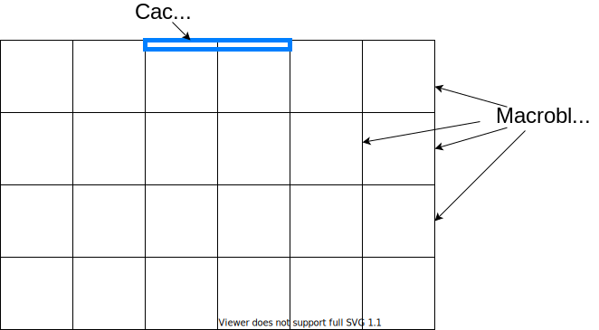

<style>
.left {
    margin: 1% 1% 1% 1%;
    text-align: left;
	width: 48%;
    position: absolute;
    left: 0%;
    height: 98%;
}

.right {
    margin: 1% 1% 1% 1%;
    text-align: left;
	width: 48%;
    position: absolute;
    left: 50%;
    height: 98%;
}

.top-half {
    margin: 1% 1% 1% 1%;
	height: 48%;
    text-align: left;
    position: absolute;
    top: 0%;
}

.bottom-half {
    margin: 1% 1% 1% 1%;
	height: 48%;
    text-align: left;
    position: absolute;
    top: 50%;
}

.fullscreen {
    position: absolute;
    height: 100%;
    width: 100%;
    left: 0%;
    top: 0%;
}

svg {
	stroke-width: 2;
}

#text { 
#	font-size: 36px; 
#}

.reveal pre code {
  display: block;
  padding: 5px;
  overflow: auto;
  max-height: 100%;
  word-wrap: normal;
}

.dashed { 
	stroke-dasharray: 4 4; 
}

</style>
<svg xmlns="http://www.w3.org/2000/svg">
  <defs>
    <svg id="fork" viewBox="0 0 200 80" overflow="visible" height="80" width="200">
      <rect rx="40" ry="40" width="200" height="80" class="line-default" />
      <text x="100" y="55" text-anchor="middle" class="fill-default">fork</text>
    </svg>
    <svg id="join" viewBox="0 0 200 80" overflow="visible" height="80" width="200">
      <rect rx="40" ry="40" width="200" height="80" class="line-default" />
      <text x="100" y="55" text-anchor="middle" class="fill-default">join</text>
    </svg>
    <svg id="cache" viewBox="0 0 1900 1200" overflow="visible" height="1200" width="1900">
      <circle cx="200"  cy="100" r="100" class="box"/>
      <circle cx="700"  cy="100" r="100" class="box"/>
      <circle cx="1200" cy="100" r="100" class="box"/>
      <circle cx="1700" cy="100" r="100" class="box"/>
      <text x="200"  y="120" text-anchor="middle" class="fill-default">Core 1</text>
      <text x="700"  y="120" text-anchor="middle" class="fill-default">Core 2</text>
      <text x="1200" y="120" text-anchor="middle" class="fill-default">Core 3</text>
      <text x="1700" y="120" text-anchor="middle" class="fill-default">Core 4</text>
      <rect x="0"    y="400" width="400" height="300" class="box" />
      <rect x="500"  y="400" width="400" height="300" class="box" />
      <rect x="1000" y="400" width="400" height="300" class="box" />
      <rect x="1500" y="400" width="400" height="300" class="box" />
      <text x="200"  y="450" text-anchor="middle" class="fill-default">Cache 1</text>
      <text x="700"  y="450" text-anchor="middle" class="fill-default">Cache 2</text>
      <text x="1200" y="450" text-anchor="middle" class="fill-default">Cache 3</text>
      <text x="1700" y="450" text-anchor="middle" class="fill-default">Cache 4</text>
      <rect x="600" y="900" width="700" height="300" class="box" />
      <text x="950" y="950" text-anchor="middle" class="fill-default">Memory</text>
    </svg>
  </defs>
</svg>

## Efficient multicore programming in C++

Author: Dries De Winter


## TOC
- Chapter 1: Context
- Chapter 2: Fork-Join Parallelism
- Chapter 3: Computer hardware architecture 
- Chapter 4: Memory ordering 
- Chapter 5: Common mistakes


# Chapter 1: Context


### Moore's law
 <!-- .element width="60%" -->


### Dennard scaling
 <!-- .element width="15%" -->

`$$ P = \alpha C F V^2 $$`


 <!-- .element width="60%" -->


<!-- .slide: data-auto-animate -->
 <!-- .element width="70%" -->


<!-- .slide: data-auto-animate -->
 <!-- .element width="70%" -->


<!-- .slide: data-auto-animate -->
### About the author
<div class="left" style="height: auto; text-align: right;"> 

</div>
<div class="right">
<ul>
<li>2007: Graduated at UGent</li>
</ul>
</div>


<!-- .slide: data-auto-animate -->
### About the author
<div class="left" style="height: auto; text-align: right;"> 

</div>
<div class="right">
<ul>
<li>2007: Graduated at UGent</li>
<li>2013: Joined Cisco Video Technology Group (later Synamedia) as Sioux consultant</li>
</ul>
</div>


<!-- .slide: data-auto-animate -->
### About the author
<div class="left" style="height: auto; text-align: right;"> 

</div>
<div class="right">
<ul>
<li>2007: Graduated at UGent</li>
<li>2013: Joined Cisco Video Technology Group (later Synamedia) as Sioux consultant</li>
<li>2015: Migration of video processing pipeline from hardware to software</li>
</ul>
</div>


 <!-- .element width="70%" -->


<!-- .slide: data-auto-animate -->
## What is optimization?
Trade-off between various _technical_ and _economic_ objectives:
- Improve exectuion speed of program
- Reduce engineering effort
- Improve reliability
- Reduce hardware cost
- Reduce power consumption


<!-- .slide: data-auto-animate -->
## What is optimization?
Trade-off between various _technical_ and _economic_ objectives:
- Improve exectuion speed of program
- Reduce engineering effort
- Improve reliability
- Reduce hardware cost
- Reduce power consumption

An _optimized program_ is never _optimal_, rather just _good enough_


<!-- .slide: data-auto-animate -->
## What is optimization?
Trade-off between various _technical_ and _economic_ objectives:
- Improve exectuion speed of program
- Reduce engineering effort
- Improve reliability
- Reduce hardware cost
- Reduce power consumption

An _optimized program_ is never _optimal_, rather just _good enough_

_"Premature optimization is the root of all evil"_ - Donald Knuth, 1974


<!-- .slide: data-auto-animate -->
## Optimization opportunities #1
- Choose or design efficient algorithm
- Write efficient source code
- Compile to efficient object code


<!-- .slide: data-auto-animate -->
## Optimization opportunities #1
- Choose or design efficient algorithm <!-- .element class="greyed-out" -->
- Write efficient source code
- Compile to efficient object code <!-- .element class="greyed-out" -->


<!-- .slide: data-auto-animate -->
## Optimization opportunities #2
- Less instructions
- Faster instructions
- Parallelization
  - Multi-process
  - Multi-threading
  - SIMD: single instruction, multiple data (GPUs, Intel SSE and AVX extensions...)


<!-- .slide: data-auto-animate -->
## Optimization opportunities #2
- Less instructions <!-- .element class="greyed-out" -->
- Faster instructions <!-- .element class="greyed-out" -->
- Parallelization
  - Multi-process <!-- .element class="greyed-out" -->
  - Multi-threading
  - SIMD: single instruction, multiple data (GPUs, Intel SSE and AVX extensions...) <!-- .element class="greyed-out" -->


<!-- .slide: data-auto-animate -->
## Efficient multicore programming in C++


<!-- .slide: data-auto-animate -->
## <span class="greyed-out">Efficient multicore programming</span> in C++
- Theory is language-agnostic
- Code examples and exercises are in modern C++


# Chapter 2: Fork-Join Parallelism


<!-- .slide: class="fullscreen" -->
## Fork-Join Pattern
<div class="left"> 
<svg xmlns="http://www.w3.org/2000/svg" viewBox="0 0 1000 1000" overflow="visible">
  <path d="M 500 0 l 0 160" class="line-default" marker-end="url(#arrowhead)" /> 
  <use href="#fork" x="400" y="170"/> 
  <path d="M 500 250 q 0 75 -200 75 q -200 0 -200 75" class="line-default" marker-end="url(#arrowhead)" /> 
  <path d="M 500 250 q 0 75 -70 75 q -70 0 -70 75" class="line-default" marker-end="url(#arrowhead)" /> 
  <path d="M 500 250 q 0 75 70 75 q 70 0 70 75" class="line-default" marker-end="url(#arrowhead)" /> 
  <path d="M 500 250 q 0 75 200 75 q 200 0 200 75" class="line-default" marker-end="url(#arrowhead)" /> 
  <path d="M 100 400 l 0 200" class="line-default" /> 
  <path d="M 360 400 l 0 200" class="line-default" /> 
  <path d="M 640 400 l 0 200" class="line-default" /> 
  <path d="M 900 400 l 0 200" class="line-default" /> 
  <path d="M 900 600 q 0 75 -200 75 q -200 0 -200 75" class="line-default" marker-end="url(#arrowhead)" /> 
  <path d="M 640 600 q 0 75 -70 75 q -70 0 -70 75" class="line-default" marker-end="url(#arrowhead)" /> 
  <path d="M 360 600 q 0 75 70 75 q 70 0 70 75" class="line-default" marker-end="url(#arrowhead)" /> 
  <path d="M 100 600 q 0 75 200 75 q 200 0 200 75" class="line-default" marker-end="url(#arrowhead)" /> 
  <use href="#join" x="400" y="750"/> 
  <path d="M 500 830 l 0 160" class="line-default" marker-end="url(#arrowhead)" /> 
</svg>
</div>
<div class="right">
<div class="top-half"></div>
<div class="bottom-half">
<ul>
<li>Utilizes higher-level programming constructs</li>
<li>Creation of threads is application responsibility</li>
<li>OS handles scheduling across processors</li>
</ul>
</div>
</div>


<!-- .slide: class="fullscreen" data-auto-animate -->
## Fork-Join example
<div class="left" style="height: auto;">
<svg xmlns="http://www.w3.org/2000/svg" viewBox="0 0 1000 1000" overflow="visible">
  <path d="M 500 0 l 0 160" class="line-default" marker-end="url(#arrowhead)" /> 
  <use href="#fork" x="400" y="170"/> 
  <path d="M 500 250 q 0 75 -100 75 q -100 0 -100 75" class="line-default" marker-end="url(#arrowhead)" /> 
  <path d="M 500 250 q 0 75 100 75 q 100 0 100 75" class="line-default" marker-end="url(#arrowhead)" /> 
  <path d="M 300 400 l 0 200" class="line-default" /> 
  <path d="M 700 400 l 0 200" class="line-default" /> 
  <path d="M 700 600 q 0 75 -100 75 q -100 0 -100 75" class="line-default" marker-end="url(#arrowhead)" /> 
  <path d="M 300 600 q 0 75 100 75 q 100 0 100 75" class="line-default" marker-end="url(#arrowhead)" /> 
  <use href="#join" x="400" y="750"/> 
</svg>
<div style="position: absolute; left: 30%; top: 0; width: 40%; height: 10%;">

```cpp
int x=0;
```
</div>
<div style="position: absolute; left: 5%; top: 40%; width: 40%; height: 20%;">

```cpp
++x;
std::cout << x;
```
</div>
<div style="position: absolute; left: 55%; top: 40%; width: 40%; height: 20%;">

```cpp
++x;
std::cout << x;
```
</div>
</div>


<!-- .slide: class="fullscreen" data-auto-animate -->
## Fork-Join example
<div class="left">

```cpp[]
int x = 0;
std::thread t1([&]() { 
    ++x;
    std::cout << x;
});
std::thread t2([&]() { 
    ++x;
    std::cout << x;
});
t1.join();
t2.join();
```
</div>


<!-- .slide: class="fullscreen" data-auto-animate -->
## Fork-Join example
<div class="left">

```cpp[]
int x = 0;
std::thread t1([&]() { 
    ++x;
    std::cout << x;
});
std::thread t2([&]() { 
    ++x;
    std::cout << x;
});
t1.join();
t2.join();
```
</div>
<div class="right">
<p>Quiz: What are the possible print-outs of this program?</p>
<ul>
<li>11</li>
<li>12</li>
<li>21</li>
<li>22</li>
</ul>
</div>


<!-- .slide: class="fullscreen" data-auto-animate -->
## Fork-Join example
<div class="left">

```cpp [3-4,7-8]
int x = 0;
std::thread t1([&]() { 
    int a = ++x;
    std::cout << a;
});
std::thread t2([&]() { 
    int b = ++x;
    std::cout << b;
});
t1.join();
t2.join();
```
</div>
<div class="right">
<p>Quiz: What are the possible print-outs of this program?</p>
<ul>
<li>11</li>
<li>12</li>
<li>21</li>
<li>22</li>
</ul>
</div>


<!-- .slide: class="fullscreen" data-auto-animate -->
## Fork-Join example
<div class="left">

```cpp [2,4-8,12-16]
int x = 0;
std::mutex mtx;
std::thread t1([&]() {
    int a = 0;
    {
      std::lock_guard<std::mutex> lock(mtx);
      a = ++x;
    }
    std::cout << a;
});
std::thread t2([&]() {
    int b = 0;
    {
        std::lock_guard<std::mutex> lock(mtx);
        b = ++x;
    }
    std::cout << b;
});
t1.join();
t2.join();
```
</div>
<div class="right">
<p>Quiz: What are the possible print-outs of this program?</p>
<ul>
<li>11</li>
<li>12</li>
<li>21</li>
<li>22</li>
</ul>
</div>


<!-- .slide: class="fullscreen" data-auto-animate -->
## Fork-Join example
<div class="left">

```cpp [2,4-8,12-16]
int x = 0;
std::mutex mtx;
std::thread t1([&]() {
    int a = 0;
    {
      std::lock_guard<std::mutex> lock(mtx);
      a = ++x;
    }
    std::cout << a;
});
std::thread t2([&]() {
    int b = 0;
    {
        std::lock_guard<std::mutex> lock(mtx);
        b = ++x;
    }
    std::cout << b;
});
t1.join();
t2.join();
```
</div>
<div class="right">
<p>Quiz: What are the possible print-outs of this program?</p>
<ul>
<li class="greyed-out">11</li>
<li>12</li>
<li>21</li>
<li class="greyed-out">22</li>
</ul>
</div>


<!-- .slide: class="fullscreen" data-auto-animate -->
## Fork-Join example
<div class="left">

```cpp [3-6,8,11]
int x = 0;
std::mutex mtx;
auto next = [&] {
    std::lock_guard<std::mutex> lock(mtx);
    return ++x;
};
std::thread t1([&]() {
    std::cout << next();
});
std::thread t2([&]() {
    std::cout << next();
});
t1.join();
t2.join();
```
</div>
<div class="right">
<p>Quiz: What are the possible print-outs of this program?</p>
<ul>
<li class="greyed-out">11</li>
<li>12</li>
<li>21</li>
<li class="greyed-out">22</	li>
</ul>
</div>


<!-- .slide: class="fullscreen" data-auto-animate -->
## Fork-Join example
<div class="left">

```cpp [8-10,13-18,21-25]
int x = 0;
std::mutex mtx;
auto next = [&] {
    std::lock_guard<std::mutex> lock(mtx);
    return ++x;
};

std::mutex mtx_ready;
std::condition_variable cv_ready;
bool ready = false;

std::thread t1([&]() {
    std::cout << next();
    {
        std::lock_guard<std::mutex> lock(mtx_ready);
        ready = true;
    }
    cv_ready.notify_all();
});
std::thread t2([&]() {
    {
        std::unique_lock<std::mutex> lock(mtx_ready);
        cv_ready.wait(lock, [&] { return ready; });
    }
    std::cout << next();
});
t1.join();
t2.join();
```
</div>
<div class="right">
<p>Quiz: What are the possible print-outs of this program?</p>
<ul>
<li class="greyed-out">11</li>
<li>12</li>
<li class="greyed-out">21</li>
<li class="greyed-out">22</li>
</ul>
</div>


## References
- `std::thread` https://en.cppreference.com/w/cpp/thread/thread
- `std::mutex` https://en.cppreference.com/w/cpp/thread/mutex
- `std::condition_variable` https://en.cppreference.com/w/cpp/thread/condition_variable


## Task parallelism
- Spread different **tasks** across multiple threads
- #threads = #tasks
- AKA functional parallelism
<svg xmlns="http://www.w3.org/2000/svg" viewBox="0 0 1000 200" overflow="visible">
  <path d="M 0 100 l 50 0" class="line-default" marker-end="url(#arrowhead)" />
  <rect x="50" y="50" width="200" height="100" class="line-default" />
  <text x="150" y="120" text-anchor="middle" font-size=50 class="fill-default">A</text>
  <path d="M 250 100 l 50 0" class="line-default" marker-end="url(#arrowhead)" />
  <rect x="300" y="50" width="400" height="100" class="line-default" />
  <text x="500" y="120" text-anchor="middle" font-size=50 class="fill-default">B</text>
  <path d="M 700 100 l 50 0" class="line-default" marker-end="url(#arrowhead)" />
  <rect x="750" y="50" width="200" height="100" class="line-default" />
  <text x="850" y="120" text-anchor="middle" font-size=50 class="fill-default">C</text>
  <path d="M 950 100 l 50 0" class="line-default" marker-end="url(#arrowhead)" />
</svg>


## Task parallelism - example
<video data-autoplay src="assembly line.webm"></video><!-- .element width="50%" -->


## Task parallelism - requirements
- Tasks are loosely coupled
- Data flows preferably in one direction (pipeline)
- Tasks have similar duration (longest duration is bottleneck)


## Task parallelism - timing
<svg xmlns="http://www.w3.org/2000/svg" viewBox="0 -100 2000 500" overflow="visible">
  <path d="M 200 100 l 1600 0" class="line-default" marker-end="url(#arrowhead)" />
  <text x="200" y="90" class="fill-default">thread1</text>
  <path d="M 200 200 l 1600 0" class="line-default" marker-end="url(#arrowhead)" />
  <text x="200" y="190" class="fill-default">thread2</text>
  <path d="M 200 300 l 1600 0" class="line-default" marker-end="url(#arrowhead)" />
  <text x="200" y="290" class="fill-default">thread3</text>

  <path d="M 500 -50 l 0 100" class="line-default dashed" marker-end="url(#arrowhead)" />
  <text x="500" y="-25" class="fill-default">d0</text>
  <path d="M 660 -50 l 0 100" class="line-default dashed" marker-end="url(#arrowhead)" />
  <text x="660" y="-25" class="fill-default">d1</text>
  <path d="M 820 -50 l 0 100" class="line-default dashed" marker-end="url(#arrowhead)" />
  <text x="820" y="-25" class="fill-default">d2</text>
  
  <rect x="500" y="50" width="160" height="50" class="line-default" />
  <text x="580" y="90" text-anchor="middle" class="fill-default">A(d0)</text>
  <rect x="660" y="50" width="160" height="50" class="line-default" />
  <text x="740" y="90" text-anchor="middle" class="fill-default">A(d1)</text>
  <rect x="820" y="50" width="240" height="50" class="line-default" />
  <text x="940" y="90" text-anchor="middle" class="fill-default">A(d2)</text>

  <path d="M 660 100 l 0 50" class="line-default dashed" marker-end="url(#arrowhead)" />
  <path d="M 820 100 l 0 50" class="line-default dashed" marker-end="url(#arrowhead)" />
  <path d="M 1060 100 l 0 50" class="line-default dashed" marker-end="url(#arrowhead)" />
  
  <rect x="660" y="150" width="240" height="50" class="line-default" />
  <text x="780" y="190" text-anchor="middle" class="fill-default">B(d0)</text>
  <rect x="900" y="150" width="240" height="50" class="line-default" />
  <text x="1020" y="190" text-anchor="middle" class="fill-default">B(d1)</text>
  <rect x="1140" y="150" width="360" height="50" class="line-default" />
  <text x="1320" y="190" text-anchor="middle" class="fill-default">B(d2)</text>

  <path d="M 900 200 l 0 50" class="line-default dashed" marker-end="url(#arrowhead)" />
  <path d="M 1140 200 l 0 50" class="line-default dashed" marker-end="url(#arrowhead)" />
  <path d="M 1500 200 l 0 50" class="line-default dashed" marker-end="url(#arrowhead)" />
  
  <rect x="900" y="250" width="160" height="50" class="line-default" />
  <text x="980" y="290" text-anchor="middle" class="fill-default">C(d0)</text>
  <rect x="1140" y="250" width="160" height="50" class="line-default" />
  <text x="1220" y="290" text-anchor="middle" class="fill-default">C(d1)</text>
  <rect x="1500" y="250" width="240" height="50" class="line-default" />
  <text x="1620" y="290" text-anchor="middle" class="fill-default">C(d2)</text>
  
  <path d="M 1060 300 l 0 100" class="line-default dashed" marker-end="url(#arrowhead)" />
  <path d="M 1300 300 l 0 100" class="line-default dashed" marker-end="url(#arrowhead)" />
  <path d="M 1740 300 l 0 100" class="line-default dashed" marker-end="url(#arrowhead)" />
</svg>


## Data parallelism
**Different threads** run **same task**, but on **different data**.

(opposite of task parallelism)


## Data parallelism - example
 <!-- .element width="60%" -->


## Data parallelism - requirements
- Data can be split in loosely coupled iterations
  - Enough iterations
  - Enough time per iteration
  - Little or no dependencies
- Different iterations have similar duration (longest duration is bottleneck)


## Data parallelism - timing
<svg xmlns="http://www.w3.org/2000/svg" viewBox="0 -100 2000 500" overflow="visible">
  <path d="M 200 100 l 1600 0" class="line-default" marker-end="url(#arrowhead)" />
  <text x="200" y="90" class="fill-default">thread1</text>
  <path d="M 200 200 l 1600 0" class="line-default" marker-end="url(#arrowhead)" />
  <text x="200" y="190" class="fill-default">thread2</text>
  <path d="M 200 300 l 1600 0" class="line-default" marker-end="url(#arrowhead)" />
  <text x="200" y="290" class="fill-default">thread3</text>

  <path d="M 500 -50 l 0 100" class="line-default dashed" marker-end="url(#arrowhead)" />
  <text x="500" y="-25" class="fill-default">d0</text>
  <path d="M 550 -50 l 0 200" class="line-default dashed" marker-end="url(#arrowhead)" />
  <text x="550" y="-25" class="fill-default">d1</text>
  <path d="M 600 -50 l 0 300" class="line-default dashed" marker-end="url(#arrowhead)" />
  <text x="600" y="-25" class="fill-default">d2</text>
  
  <rect x="500" y="50" width="160" height="50" class="line-default" />
  <text x="580" y="90" text-anchor="middle" class="fill-default">A(d0)</text>
  <rect x="550" y="150" width="160" height="50" class="line-default" />
  <text x="630" y="190" text-anchor="middle" class="fill-default">A(d1)</text>
  <rect x="600" y="250" width="240" height="50" class="line-default" />
  <text x="720" y="290" text-anchor="middle" class="fill-default">A(d2)</text>

  <rect x="660" y="50" width="240" height="50" class="line-default" />
  <text x="780" y="90" text-anchor="middle" class="fill-default">B(d0)</text>
  <rect x="710" y="150" width="240" height="50" class="line-default" />
  <text x="830" y="190" text-anchor="middle" class="fill-default">B(d1)</text>
  <rect x="840" y="250" width="360" height="50" class="line-default" />
  <text x="1020" y="290" text-anchor="middle" class="fill-default">B(d2)</text>

  <rect x="900" y="50" width="160" height="50" class="line-default" />
  <text x="980" y="90" text-anchor="middle" class="fill-default">C(d0)</text>
  <rect x="950" y="150" width="160" height="50" class="line-default" />
  <text x="1030" y="190" text-anchor="middle" class="fill-default">C(d1)</text>
  <rect x="1200" y="250" width="240" height="50" class="line-default" />
  <text x="1320" y="290" text-anchor="middle" class="fill-default">C(d2)</text>
  
  <path d="M 1060 100 l 0 300" class="line-default dashed" marker-end="url(#arrowhead)" />
  <path d="M 1110 200 l 0 200" class="line-default dashed" marker-end="url(#arrowhead)" />
  <path d="M 1440 300 l 0 100" class="line-default dashed" marker-end="url(#arrowhead)" />
</svg>


## Nested parallelism
Combination of task parallelism and data parallelism


## Nested parallelism - practical example
- A 6-core machine runs an algorithm consisting op operations A(), B() and C() with the following properties:
  - A() takes 60 ms
  - B() takes 153 ms
  - C() takes 45 ms
  - A(), B() and C() are independent
  - A(), B() and C() operate on the same data set consisting of 800 elements.
  - &rarr; Sequential implementation takes 258 ms.
<svg xmlns="http://www.w3.org/2000/svg" viewBox="-200 0 1500 200" overflow="visible">
  <path d="M 0 75 l 50 0" class="line-default" marker-end="url(#arrowhead)" />
  <rect x="50" y="50" width="180" height="50" class="line-default" />
  <text x="140" y="90" text-anchor="middle" font-size=50 class="fill-default">A</text>
  <path d="M 230 75 l 50 0" class="line-default" marker-end="url(#arrowhead)" />
  <rect x="280" y="50" width="460" height="50" class="line-default" />
  <text x="510" y="90" text-anchor="middle" font-size=50 class="fill-default">B</text>
  <path d="M 740 75 l 50 0" class="line-default" marker-end="url(#arrowhead)" />
  <rect x="790" y="50" width="140" height="50" class="line-default" />
  <text x="860" y="90" text-anchor="middle" font-size=50 class="fill-default">C</text>
  <path d="M 930 75 l 50 0" class="line-default" marker-end="url(#arrowhead)" />
</svg>


<!-- .slide: data-auto-animate -->
## Practical example - functional partitioning
<svg xmlns="http://www.w3.org/2000/svg" viewBox="0 -200 2000 800" overflow="visible">
  <path d="M 100 175 l 100 0" class="line-default" marker-end="url(#arrowhead)" />
  <use href="#fork" x="200" y="135"/> 
  <path d="M 400 175 q 150 0 150 -50 q 0 -50 150 -50" class="line-default" marker-end="url(#arrowhead)" /> 
  <path d="M 400 175 q 150 0 150 0 q 0 0 150 0" class="line-default" marker-end="url(#arrowhead)" /> 
  <path d="M 400 175 q 150 0 150 50 q 0 50 150 50" class="line-default" marker-end="url(#arrowhead)" /> 
  <rect x="700" y="50" width="180" height="50" class="line-default" />
  <rect x="700" y="150" width="460" height="50" class="line-default" />
  <rect x="700" y="250" width="140" height="50" class="line-default" />
  <text x="790" y="90" text-anchor="middle" font-size=50 class="fill-default">A</text>
  <text x="930" y="190" text-anchor="middle" font-size=50 class="fill-default">B</text>
  <text x="770" y="290" text-anchor="middle" font-size=50 class="fill-default">C</text>
  <path d="M 880 75 q 470 0 470 50 q 0 50 150 50" class="line-default" marker-end="url(#arrowhead)" /> 
  <path d="M 1160 175 q 190 0 190 0 q 0 0 150 0" class="line-default" marker-end="url(#arrowhead)" /> 
  <path d="M 840 275 q 510 0 510 -50 q 0 -50 150 -50" class="line-default" marker-end="url(#arrowhead)" /> 
  <use href="#join" x="1500" y="135"/> 
  <path d="M 1700 175 l 100 0" class="line-default" marker-end="url(#arrowhead)" />
</svg>
<ul>
<li>A(), B() and C() can run in parallel</li>
<li>But B() is the bottleneck &rarr; Total time = 153 ms.</li>
<li>Still 3-5 cores unused.</li>
</ul>


<!-- .slide: data-auto-animate -->
## Practical example - functional partitioning
<svg xmlns="http://www.w3.org/2000/svg" viewBox="0 -200 2000 800" overflow="visible">
  <path d="M 100 175 l 100 0" class="line-default" marker-end="url(#arrowhead)" />
  <use href="#fork" x="200" y="135"/> 
  <path d="M 400 175 q 150 0 150 -100 q 0 -100 150 -100" class="line-default" marker-end="url(#arrowhead)" /> 
  <path d="M 400 175 q 150 0 150 -50 q 0 -50 150 -50" class="line-default" marker-end="url(#arrowhead)" /> 
  <path d="M 400 175 q 150 0 150 0 q 0 0 150 0" class="line-default" marker-end="url(#arrowhead)" /> 
  <path d="M 400 175 q 150 0 150 50 q 0 50 150 50" class="line-default" marker-end="url(#arrowhead)" /> 
  <path d="M 400 175 q 150 0 150 100 q 0 100 150 100" class="line-default" marker-end="url(#arrowhead)" /> 
  <rect x="700" y="-50" width="180" height="50" class="line-default" />
  <rect x="700" y="50" width="154" height="50" class="line-default" />
  <rect x="700" y="150" width="154" height="50" class="line-default" />
  <rect x="700" y="250" width="154" height="50" class="line-default" />
  <rect x="700" y="350" width="140" height="50" class="line-default" />
  <text x="790" y="-10" text-anchor="middle" font-size=50 class="fill-default">A</text>
  <text x="777" y="90" text-anchor="middle" font-size=50 class="fill-default">B</text>
  <text x="777" y="190" text-anchor="middle" font-size=50 class="fill-default">B</text>
  <text x="777" y="290" text-anchor="middle" font-size=50 class="fill-default">B</text>
  <text x="770" y="390" text-anchor="middle" font-size=50 class="fill-default">C</text>
  <path d="M 880 -25 q 470 0 470 100 q 0 100 150 100" class="line-default" marker-end="url(#arrowhead)" /> 
  <path d="M 854 75 q 496 0 496 50 q 0 50 150 50" class="line-default" marker-end="url(#arrowhead)" /> 
  <path d="M 854 175 q 496 0 496 0 q 0 0 150 0" class="line-default" marker-end="url(#arrowhead)" /> 
  <path d="M 854 275 q 496 0 496 -50 q 0 -50 150 -50" class="line-default" marker-end="url(#arrowhead)" /> 
  <path d="M 840 375 q 510 0 510 -100 q 0 -100 150 -100" class="line-default" marker-end="url(#arrowhead)" /> 
  <use href="#join" x="1500" y="135"/> 
  <path d="M 1700 175 l 100 0" class="line-default" marker-end="url(#arrowhead)" />
</svg>
<ul>
<li>Split B() over 3 threads, each taking 51 ms.</li>
<li>Still 1 unused core, but further distribution of B() is useless. A() is the bottleneck now &rarr; Total time = 60 ms.</li>
</ul>


<!-- .slide: data-auto-animate -->
## Practical example - functional partitioning
<svg xmlns="http://www.w3.org/2000/svg" viewBox="0 -200 2000 800" overflow="visible">
  <path d="M 100 175 l 100 0" class="line-default" marker-end="url(#arrowhead)" />
  <use href="#fork" x="200" y="135"/> 
  <path d="M 400 175 q 150 0 150 -150 q 0 -150 150 -150" class="line-default" marker-end="url(#arrowhead)" /> 
  <path d="M 400 175 q 150 0 150 -100 q 0 -100 150 -100" class="line-default" marker-end="url(#arrowhead)" /> 
  <path d="M 400 175 q 150 0 150 -50 q 0 -50 150 -50" class="line-default" marker-end="url(#arrowhead)" /> 
  <path d="M 400 175 q 150 0 150 0 q 0 0 150 0" class="line-default" marker-end="url(#arrowhead)" /> 
  <path d="M 400 175 q 150 0 150 50 q 0 50 150 50" class="line-default" marker-end="url(#arrowhead)" /> 
  <path d="M 400 175 q 150 0 150 100 q 0 100 150 100" class="line-default" marker-end="url(#arrowhead)" /> 
  <rect x="700" y="-150" width="90" height="50" class="line-default" />
  <rect x="700" y="-50" width="90" height="50" class="line-default" />
  <rect x="700" y="50" width="154" height="50" class="line-default" />
  <rect x="700" y="150" width="154" height="50" class="line-default" />
  <rect x="700" y="250" width="154" height="50" class="line-default" />
  <rect x="700" y="350" width="140" height="50" class="line-default" />
  <text x="745" y="-110" text-anchor="middle" font-size=50 class="fill-default">A</text>
  <text x="745" y="-10" text-anchor="middle" font-size=50 class="fill-default">A</text>
  <text x="777" y="90" text-anchor="middle" font-size=50 class="fill-default">B</text>
  <text x="777" y="190" text-anchor="middle" font-size=50 class="fill-default">B</text>
  <text x="777" y="290" text-anchor="middle" font-size=50 class="fill-default">B</text>
  <text x="770" y="390" text-anchor="middle" font-size=50 class="fill-default">C</text>
  <path d="M 790 -125 q 560 0 560 150 q 0 150 150 150" class="line-default" marker-end="url(#arrowhead)" /> 
  <path d="M 790 -25 q 560 0 560 100 q 0 100 150 100" class="line-default" marker-end="url(#arrowhead)" /> 
  <path d="M 854 75 q 496 0 496 50 q 0 50 150 50" class="line-default" marker-end="url(#arrowhead)" /> 
  <path d="M 854 175 q 496 0 496 0 q 0 0 150 0" class="line-default" marker-end="url(#arrowhead)" /> 
  <path d="M 854 275 q 496 0 496 -50 q 0 -50 150 -50" class="line-default" marker-end="url(#arrowhead)" /> 
  <path d="M 840 375 q 510 0 510 -100 q 0 -100 150 -100" class="line-default" marker-end="url(#arrowhead)" /> 
  <use href="#join" x="1500" y="135"/> 
  <path d="M 1700 175 l 100 0" class="line-default" marker-end="url(#arrowhead)" />
</svg>
<ul>
<li>6 tasks distributed over 6 cores</li>
<li>Total time = 51 ms</li>
</ul>


<!-- .slide: data-auto-animate -->
## Practical example - data partitioning
<svg xmlns="http://www.w3.org/2000/svg" viewBox="0 -200 2000 800" overflow="visible">
  <defs>
    <svg id="onepipe" viewBox="0 0 358 50" overflow="visible" height="50" width="358">
	  <rect x="0" y="0" width="60" height="50" class="line-default" />
      <rect x="110" y="0" width="153" height="50" class="line-default" />
      <rect x="313" y="0" width="45" height="50" class="line-default" />
      <path d="M 60 25 l 50 0" class="line-default" marker-end="url(#arrowhead)" />
  	  <path d="M 263 25 l 50 0" class="line-default" marker-end="url(#arrowhead)" />
      <text x="30" y="40" text-anchor="middle" class="fill-default">A</text>
      <text x="187" y="40" text-anchor="middle" class="fill-default">B</text>
      <text x="335" y="40" text-anchor="middle" class="fill-default">C</text>
    </svg>
  </defs>
  <path d="M 100 175 l 100 0" class="line-default" marker-end="url(#arrowhead)" />
  <use href="#fork" x="200" y="135"/> 
  <path d="M 400 175 q 150 0 150 -150 q 0 -150 150 -150" class="line-default" marker-end="url(#arrowhead)" /> 
  <path d="M 400 175 q 150 0 150 -100 q 0 -100 150 -100" class="line-default" marker-end="url(#arrowhead)" /> 
  <path d="M 400 175 q 150 0 150 -50 q 0 -50 150 -50" class="line-default" marker-end="url(#arrowhead)" /> 
  <path d="M 400 175 q 150 0 150 0 q 0 0 150 0" class="line-default" marker-end="url(#arrowhead)" /> 
  <path d="M 400 175 q 150 0 150 50 q 0 50 150 50" class="line-default" marker-end="url(#arrowhead)" /> 
  <path d="M 400 175 q 150 0 150 100 q 0 100 150 100" class="line-default" marker-end="url(#arrowhead)" />
  <use href="#onepipe" x="700" y="-150"/> 
  <use href="#onepipe" x="700" y="-50"/> 
  <use href="#onepipe" x="700" y="50"/> 
  <use href="#onepipe" x="700" y="150"/> 
  <use href="#onepipe" x="700" y="250"/> 
  <use href="#onepipe" x="700" y="350"/> 
  <path d="M 1058 -125 q 292 0 292 150 q 0 150 150 150" class="line-default" marker-end="url(#arrowhead)" /> 
  <path d="M 1058 -25 q 292 0 292 100 q 0 100 150 100" class="line-default" marker-end="url(#arrowhead)" /> 
  <path d="M 1058 75 q 292 0 292 50 q 0 50 150 50" class="line-default" marker-end="url(#arrowhead)" /> 
  <path d="M 1058 175 q 292 0 292 0 q 0 0 150 0" class="line-default" marker-end="url(#arrowhead)" /> 
  <path d="M 1058 275 q 292 0 292 -50 q 0 -50 150 -50" class="line-default" marker-end="url(#arrowhead)" /> 
  <path d="M 1058 375 q 292 0 292 -100 q 0 -100 150 -100" class="line-default" marker-end="url(#arrowhead)" /> 
  <use href="#join" x="1500" y="135"/> 
  <path d="M 1700 175 l 100 0" class="line-default" marker-end="url(#arrowhead)" />
</svg>
<ul>
<li>Divide 800 items over 6 threads &rarr; 2 threads handle 134 items and 4 threads handle 133 items</li>
<li>Total time = 43.2 ms</li>
</ul>


## Exercise


## Exercise - get started
```sh
cd multicore-exercises
mkdir -p build
cd build
cmake ..
make
make test
```


## Exercise - json2xml impl1
```sh
make impl1
ctest -V -R impl1
./impl1 < ../jsonxml/test-file.json
time ./impl1 < ./large-file.json > large-file.xml
```
Source code: see `impl1.cpp` 


<!-- .slide: data-auto-animate -->
## Exercise - step1
- Speed up impl1 using fork-join parallelization.
- Hint: input json is always an array at the root.
- Better hint: see code.


<!-- .slide: data-auto-animate -->
## Exercise - step1
- Speed up impl1 using fork-join parallelization.
- Hint: input json is always an array at the root.
- &rarr; Start thread per item in the array.
- Better hint: see code.
- &rarr; Make std::thread where indicated by the comments, like in fork-join code examples.
- &rarr; Store threads in `std::vector<std::thread>`


<!-- .slide: data-auto-animate -->
## Exercise - step1
<iframe src="https://giphy.com/embed/uKadIjaivWCqY" width="480" height="404" frameBorder="0" class="giphy-embed" allowFullScreen></iframe>


<!-- .slide: data-auto-animate -->
## Exercise - step2
- Make thread safe using `std::ostringstream`.

```cpp[]
#include <sstream>
// ...

std::vector<std::thread> threads(number_of_threads);
std::vector<std::ostringstream> oss(number_of_threads);

// In parallelized code stream to os i.s.o. std::cout
for (std::size_t i = 0; i < number_of_threads; i++)
    threads[i] = std::thread([&, &os = oss[i]]() { os << 1 << 2 << "\n"; });

// After joining, copy all output to std::cout sequentially
for (std::size_t i = 0; i < number_of_threads; i++) {
    threads[i].join();
    std::cout << oss[i].str();
}
```


<!-- .slide: data-auto-animate -->
## Exercise - step3
Too many threads!
- Only parallelize root level
- Number of threads at root level = `std::thread::hardware_concurrency()`


<!-- .slide: data-auto-animate -->
## Exercise - step3
It works!

What is the speedup?

Can you explain?


## Measuring is important!
- Know where your bottlenecks are
- Set realistic expectations


## Time measurement in the code
```cpp[]
#include <chrono>
// ...
auto t0 = std::chrono::steady_clock::now();
// do work
auto t1 = std::chrono::steady_clock::now();
std::cerr << "It took " << (t1-t0).count() << "ns.\n";
```
```sh
./impl1 < xlarge-file.json > xlarge-file.xml 
It took 7117841255ns.
```


## Profiling using perf
```sh
perf record --call-graph=lbr ./impl1 < ./xlarge-file.json > xlarge-file.xml
perf report
```


## Profiling using google-perftools
```sh
CPUPROFILE=gperf.data LD_PRELOAD=/usr/lib/x86_64-linux-gnu/libprofiler.so.0.4.18 ./impl1 < ./xlarge-file.json > xlarge-file.xml
google-pprof --gv impl1 gperf.data
```


## Performance sanity checks
```sh
cat /proc/cpuinfo | grep MHz
cat /sys/devices/system/cpu/cpufreq/*/scaling_governor
echo performance | sudo tee /sys/devices/system/cpu/cpufreq/*/scaling_governor


## Exercise - impl2
- impl1: parse JSON into large object and then dump object to XML
- impl2: parse JSON using SAX-like interface and dump to XML on the fly, see https://nlohmann.github.io/json/features/parsing/sax_interface/ 
```sh
make impl2
ctest -V -R impl2
./impl2 < ../test-file.json
time ./impl2 < ./large-file.json > large-file.xml
```
Source code: see `impl2.cpp` 


## Exercise - impl2
- Offload formatting to dedicated thread
- Use `fifo<any_t>` to transfer all SAX parser calls to formatting thread
- Create `std::thread` that consumes the fifo in a loop until it's done


## Exercise - impl2 - evaluation
- What is the timing after step1?
- Can we get better results by splitting output in more formatting threads, like in impl1?
- How many formatting threads would you create?


## Naming threads
```cpp
#include <sys/prctl.h>
// ...
prctl(PR_SET_NAME, "parser", nullptr, nullptr, nullptr);
// ...
prctl(PR_SET_NAME, "formatter", nullptr, nullptr, nullptr);
```
```
top -H
```


## Exercise - impl3
More formatting threads


## Exercise - impl3
Challenges:
- How to distribute the `any_t`s over multiple threads?
- How to regulate access to std::cout from multiple threads?


## Exercise - impl3
 <!-- .element width="100%" -->


## Exercise - impl3
```sh
make impl3
ctest -V -R impl3
./impl3 < ../jsonxml/test-file.json
time ./impl3 < ./large-file.json > large-file.xml
```
Source code: see `impl3.cpp` 


## Exercise - impl3
... But take a look at `fifo.h`.
- Is this thread safe?
- Why does this even work? 


## Exercise - impl3
Let's try on Raspberry Pi
```sh
../sync-pi.sh
ssh pi
cd multicore-exercises
mkdir -p build
cd build
cmake ..
make impl3 make-xlarge-file.json
ctest -V -R impl3
./impl3 < ./xlarge-file.json > xlarge-file.xml 
```


## Exercise - impl3
Fix `fifo<T>` by protecting `head` and `tail` with `std::mutex` 


## Exercise - impl3
Busy loop on `full()` or `empty()` ...

Fix this using `std::condition_variable` 


## Exercise - impl3
It works!
What is the speedup?


## Exercise - impl3
To understand and fix this, we need theory of next chapter.


## Key takeaways from this chapter
- Task vs. data parallelism
  - Choose partitions wisely, which is not easy.
  - Can have a large impact on the code. 
- Parallelization comes with a cost.
  - Added complexity.
  - Yields difficult bugs.
  - May cause performance regressions rather than improvements when not done right.


# Chapter 3: Computer hardware architecture 


## Prehistory
 <!-- .element width="60%" -->


## Caches to the rescue
- Majority of memory access to small subset of memory
- Put small but fast cache close to core, holding most popular data
- `$$ t_{avg} = t_{cache} \times (1 - p_{miss}) + t_{DRAM} \times p_{miss} $$`
```sh
perf stat -e cycles,instructions,L1-dcache-loads,L1-dcache-load-misses \
    ./impl3 < xlarge-file.json >/dev/null
```
 <!-- .element width="80%" -->


<!-- .slide: class="fullscreen" -->
## Cache latency
<div class="left">

 <!-- .element width="100%" -->
*Intel Kaby Lake Cache Hierarchy and Access Latency*
</div>
<div class="right">
<table>
<tr><th></th><th>@2.5GHz</th><th></th></tr>
<tr><td>L1 cache hit latency </td><td>2 ns      </td><td><div class="shape" style="height:1em;width:0.2em;"></div></td></tr>
<tr><td>L2 cache hit latency </td><td>4.8 ns    </td><td><div class="shape" style="height:1em;width:0.5em;"></div></td></tr>
<tr><td>L3 cache hit latency </td><td>16.8 ns   </td><td><div class="shape" style="height:1em;width:1.7em;"></div></td></tr>
<tr><td>Memory access latency</td><td>~60-100 ns</td><td><div class="shape" style="height:1em;width:8em;"></div></td></tr>
</table>
<div>


## NUMA (UMA)
 <!-- .element width="50%" -->

*Uniform Memory Access*


## NUMA (Pure NUMA)
 <!-- .element width="60%" -->

*Non-Uniform Memory Access*


## NUMA (Real world)
 <!-- .element width="100%" -->

*Mixed architecture*


<!-- .slide: data-transition="none" -->
## Cache coherence
<svg xmlns="http://www.w3.org/2000/svg" viewBox="0 0 2000 1200" width="1500" height="900" overflow="visible">
  <use href="#cache" />
  <rect x="700" y="1000" width="200" height="50" class="line-default" />
  <text x="740" y="1040" text-anchor="left" class="fill-default">x=5</text>
</svg>


<!-- .slide: data-transition="none" -->
## Cache coherence
<svg xmlns="http://www.w3.org/2000/svg" viewBox="0 0 2000 1200" width="1500" height="900" overflow="visible">
  <use href="#cache" />
  <rect x="700" y="1000" width="200" height="50" class="line-default" />
  <text x="740" y="1040" text-anchor="left" class="fill-default">x=5</text>
  <path d="M 200 200 l 0 200" class="line-default" marker-end="url(#arrowhead)" /> 
  <text x="210" y="300" text-anchor="left" class="fill-default">x = x + 3</text>
</svg>


<!-- .slide: data-transition="none" -->
## Cache coherence
<svg xmlns="http://www.w3.org/2000/svg" viewBox="0 0 2000 1200" width="1500" height="900" overflow="visible">
  <use href="#cache" />
  <rect x="700" y="1000" width="200" height="50" class="line-default" />
  <text x="740" y="1040" text-anchor="left" class="fill-default">x=5</text>
  <path d="M 200 200 l 0 200" class="line-default" marker-end="url(#arrowhead)" /> 
  <text x="210" y="300" text-anchor="left" class="fill-default">x = x + 3</text>
  <text x="200" y="600" text-anchor="middle" class="fill-red">miss!</text>
  <path d="M 200 700 l 0 100 l 500 0 l 0 100" class="line-default" marker-end="url(#arrowhead)" /> 
  <text x="450" y="790" text-anchor="middle" class="fill-default">read x</text>
</svg>


<!-- .slide: data-transition="none" -->
## Cache coherence
<svg xmlns="http://www.w3.org/2000/svg" viewBox="0 0 2000 1200" width="1500" height="900" overflow="visible">
  <use href="#cache" />
  <rect x="700" y="1000" width="200" height="50" class="line-default" />
  <text x="740" y="1040" text-anchor="left" class="fill-default">x=5</text>
  <path d="M 200 200 l 0 200" class="line-default" marker-end="url(#arrowhead)" /> 
  <text x="210" y="300" text-anchor="left" class="fill-default">x = x + 3</text>
  <rect x="10" y="500" width="380" height="50" class="line-default" />
  <text x="50" y="540" text-anchor="left" class="fill-default">x=5</text>
</svg>


<!-- .slide: data-transition="none" -->
## Cache coherence
<svg xmlns="http://www.w3.org/2000/svg" viewBox="0 0 2000 1200" width="1500" height="900" overflow="visible">
  <use href="#cache" />
  <rect x="700" y="1000" width="200" height="50" class="line-default" />
  <text x="740" y="1040" text-anchor="left" class="fill-default">x=5</text>
  <rect x="10" y="500" width="380" height="50" class="line-default" />
  <text x="50" y="540" text-anchor="left" class="fill-default">x=8</text>
</svg>


<!-- .slide: data-transition="none" -->
## Cache coherence
<svg xmlns="http://www.w3.org/2000/svg" viewBox="0 0 2000 1200" width="1500" height="900" overflow="visible">
  <use href="#cache" />
  <rect x="700" y="1000" width="200" height="50" class="line-default" />
  <text x="740" y="1040" text-anchor="left" class="fill-default">x=5</text>
  <rect x="10" y="500" width="380" height="50" class="line-default" />
  <text x="50" y="540" text-anchor="left" class="fill-default">x=8</text>
  <path d="M 1200 200 l 0 200" class="line-default" marker-end="url(#arrowhead)" /> 
  <text x="1210" y="300" text-anchor="left" class="fill-default">x = x + 4</text>
</svg>


<!-- .slide: data-transition="none" -->
## Cache coherence
<svg xmlns="http://www.w3.org/2000/svg" viewBox="0 0 2000 1200" width="1500" height="900" overflow="visible">
  <use href="#cache" />
  <rect x="700" y="1000" width="200" height="50" class="line-default" />
  <text x="740" y="1040" text-anchor="left" class="fill-default">x=5</text>
  <rect x="10" y="500" width="380" height="50" class="line-default" />
  <text x="50" y="540" text-anchor="left" class="fill-default">x=8</text>
  <path d="M 1200 200 l 0 200" class="line-default" marker-end="url(#arrowhead)" /> 
  <text x="1210" y="300" text-anchor="left" class="fill-default">x = x + 4</text>
  <text x="1200" y="600" text-anchor="middle" class="fill-red">miss!</text>
  <path d="M 1200 700 l 0 100 l -100 0 l 0 100" class="line-default" marker-end="url(#arrowhead)" /> 
  <text x="1220" y="790" text-anchor="left" class="fill-default">read x</text>
</svg>


<!-- .slide: data-transition="none" -->
## Cache coherence
<svg xmlns="http://www.w3.org/2000/svg" viewBox="0 0 2000 1200" width="1500" height="900" overflow="visible">
  <use href="#cache" />
  <rect x="700" y="1000" width="200" height="50" class="line-default" />
  <text x="740" y="1040" text-anchor="left" class="fill-default">x=5</text>
  <rect x="10" y="500" width="380" height="50" class="line-default" />
  <text x="50" y="540" text-anchor="left" class="fill-default">x=8</text>
  <path d="M 1200 200 l 0 200" class="line-default" marker-end="url(#arrowhead)" /> 
  <text x="1210" y="300" text-anchor="left" class="fill-default">x = x + 4</text>
  <rect x="1010" y="500" width="380" height="50" class="line-default" />
  <text x="1050" y="540" text-anchor="left" class="fill-default">x=5</text>
</svg>


<!-- .slide: data-transition="none" -->
## Cache coherence
<svg xmlns="http://www.w3.org/2000/svg" viewBox="0 0 2000 1200" width="1500" height="900" overflow="visible">
  <use href="#cache" />
  <rect x="700" y="1000" width="200" height="50" class="line-default" />
  <text x="740" y="1040" text-anchor="left" class="fill-default">x=5</text>
  <rect x="10" y="500" width="380" height="50" class="line-default" />
  <text x="50" y="540" text-anchor="left" class="fill-default">x=8</text>
  <rect x="1010" y="500" width="380" height="50" class="line-default" />
  <text x="1050" y="540" text-anchor="left" class="fill-default">x=9</text>
</svg>


<!-- .slide: data-transition="none" -->
## Cache coherence
<svg xmlns="http://www.w3.org/2000/svg" viewBox="0 0 2000 1200" width="1500" height="900" overflow="visible">
  <use href="#cache" />
  <rect x="700" y="1000" width="200" height="50" class="line-default" />
  <text x="740" y="1040" text-anchor="left" class="fill-default">x=5</text>
  <rect x="10" y="500" width="380" height="50" class="line-grey" />
  <text x="50" y="540" text-anchor="left" class="fill-grey">x=8</text>
  <rect x="1010" y="500" width="380" height="50" class="line-default" />
  <text x="1050" y="540" text-anchor="left" class="fill-default">x=9</text>
  <path d="M 200 700 l 0 100 l 500 0 l 0 100" class="line-default" marker-end="url(#arrowhead)" /> 
  <text x="450" y="790" text-anchor="middle" class="fill-default">write x</text>
  <text x="200" y="600" text-anchor="middle" class="fill-red">evict!</text>
</svg>


<!-- .slide: data-transition="none" -->
## Cache coherence
<svg xmlns="http://www.w3.org/2000/svg" viewBox="0 0 2000 1200" width="1500" height="900" overflow="visible">
  <use href="#cache" />
  <rect x="700" y="1000" width="200" height="50" class="line-default" />
  <text x="740" y="1040" text-anchor="left" class="fill-default">x=8</text>
  <rect x="1010" y="500" width="380" height="50" class="line-default" />
  <text x="1050" y="540" text-anchor="left" class="fill-default">x=9</text>
</svg>


<!-- .slide: data-transition="none" -->
## Cache coherence
<svg xmlns="http://www.w3.org/2000/svg" viewBox="0 0 2000 1200" width="1500" height="900" overflow="visible">
  <use href="#cache" />
  <rect x="700" y="1000" width="200" height="50" class="line-default" />
  <text x="740" y="1040" text-anchor="left" class="fill-default">x=8</text>
  <rect x="1010" y="500" width="380" height="50" class="line-grey" />
  <text x="1050" y="540" text-anchor="left" class="fill-grey">x=9</text>
  <path d="M 1200 700 l 0 100 l -100 0 l 0 100" class="line-default" marker-end="url(#arrowhead)" /> 
  <text x="1210" y="790" text-anchor="left" class="fill-default">write x</text>
  <text x="1200" y="600" text-anchor="middle" class="fill-red">evict!</text>
</svg>


<!-- .slide: data-transition="none" -->
## Cache coherence
<svg xmlns="http://www.w3.org/2000/svg" viewBox="0 0 2000 1200" width="1500" height="900" overflow="visible">
  <use href="#cache" />
  <rect x="700" y="1000" width="200" height="50" class="line-default" />
  <text x="740" y="1040" text-anchor="left" class="fill-default">x=9</text>
</svg>


## Cache coherence - MSI
Every cache line has one of three states:
- **M**odified
- **S**hared
- **I**nvalid


<!-- .slide: data-transition="none" -->
## Cache coherence - MSI
<svg xmlns="http://www.w3.org/2000/svg" viewBox="0 0 2000 1200" width="1500" height="900" overflow="visible">
  <use href="#cache" />
  <rect x="700" y="1000" width="200" height="50" class="line-default" />
  <text x="740" y="1040" text-anchor="left" class="fill-default">x=5</text>
</svg>


<!-- .slide: data-transition="none" -->
## Cache coherence - MSI
<svg xmlns="http://www.w3.org/2000/svg" viewBox="0 0 2000 1200" width="1500" height="900" overflow="visible">
  <use href="#cache" />
  <rect x="700" y="1000" width="200" height="50" class="line-default" />
  <text x="740" y="1040" text-anchor="left" class="fill-default">x=5</text>
  <path d="M 200 200 l 0 200" class="line-default" marker-end="url(#arrowhead)" /> 
  <text x="210" y="300" text-anchor="left" class="fill-default">x = x + 3</text>
</svg>


<!-- .slide: data-transition="none" -->
## Cache coherence - MSI
<svg xmlns="http://www.w3.org/2000/svg" viewBox="0 0 2000 1200" width="1500" height="900" overflow="visible">
  <use href="#cache" />
  <rect x="700" y="1000" width="200" height="50" class="line-default" />
  <text x="740" y="1040" text-anchor="left" class="fill-default">x=5</text>
  <path d="M 200 200 l 0 200" class="line-default" marker-end="url(#arrowhead)" /> 
  <text x="210" y="300" text-anchor="left" class="fill-default">x = x + 3</text>
  <text x="200" y="600" text-anchor="middle" class="fill-red">miss!</text>
  <path d="M 200 700 l 0 100 l 500 0 l 0 100" class="line-default" marker-end="url(#arrowhead)" /> 
  <text x="450" y="790" text-anchor="middle" class="fill-default">read x</text>
</svg>


<!-- .slide: data-transition="none" -->
## Cache coherence - MSI
<svg xmlns="http://www.w3.org/2000/svg" viewBox="0 0 2000 1200" width="1500" height="900" overflow="visible">
  <use href="#cache" />
  <rect x="700" y="1000" width="200" height="50" class="line-default" />
  <text x="740" y="1040" text-anchor="left" class="fill-default">x=5</text>
  <path d="M 200 200 l 0 200" class="line-default" marker-end="url(#arrowhead)" /> 
  <text x="210" y="300" text-anchor="left" class="fill-default">x = x + 3</text>
  <rect x="10" y="500" width="380" height="50" class="line-default" />
  <text x="20" y="540" text-anchor="left" class="fill-default">S | x=5</text>
</svg>


<!-- .slide: data-transition="none" -->
## Cache coherence - MSI
<svg xmlns="http://www.w3.org/2000/svg" viewBox="0 0 2000 1200" width="1500" height="900" overflow="visible">
  <use href="#cache" />
  <rect x="700" y="1000" width="200" height="50" class="line-default" />
  <text x="740" y="1040" text-anchor="left" class="fill-default">x=5</text>
  <rect x="10" y="500" width="380" height="50" class="line-default" />
  <text x="20" y="540" text-anchor="left" class="fill-default">M | x=8</text>
</svg>


<!-- .slide: data-transition="none" -->
## Cache coherence - MSI
<svg xmlns="http://www.w3.org/2000/svg" viewBox="0 0 2000 1200" width="1500" height="900" overflow="visible">
  <use href="#cache" />
  <rect x="700" y="1000" width="200" height="50" class="line-default" />
  <text x="740" y="1040" text-anchor="left" class="fill-default">x=5</text>
  <rect x="10" y="500" width="380" height="50" class="line-default" />
  <text x="20" y="540" text-anchor="left" class="fill-default">M | x=8</text>
  <path d="M 1200 200 l 0 200" class="line-default" marker-end="url(#arrowhead)" /> 
  <text x="1210" y="300" text-anchor="left" class="fill-default">x = x + 4</text>
</svg>


<!-- .slide: data-transition="none" -->
## Cache coherence - MSI
<svg xmlns="http://www.w3.org/2000/svg" viewBox="0 0 2000 1200" width="1500" height="900" overflow="visible">
  <use href="#cache" />
  <rect x="700" y="1000" width="200" height="50" class="line-default" />
  <text x="740" y="1040" text-anchor="left" class="fill-default">x=5</text>
  <rect x="10" y="500" width="380" height="50" class="line-default" />
  <text x="20" y="540" text-anchor="left" class="fill-default">M | x=8</text>
  <path d="M 1200 200 l 0 200" class="line-default" marker-end="url(#arrowhead)" /> 
  <text x="1210" y="300" text-anchor="left" class="fill-default">x = x + 4</text>
  <text x="1200" y="600" text-anchor="middle" class="fill-red">miss!</text>
  <path d="M 1200 700 l 0 100 l -100 0 l 0 100" class="line-default" marker-end="url(#arrowhead)" /> 
  <text x="1220" y="790" text-anchor="left" class="fill-default">read x</text>
</svg>


<!-- .slide: data-transition="none" -->
## Cache coherence - MSI
<svg xmlns="http://www.w3.org/2000/svg" viewBox="0 0 2000 1200" width="1500" height="900" overflow="visible">
  <use href="#cache" />
  <rect x="700" y="1000" width="200" height="50" class="line-default" />
  <text x="740" y="1040" text-anchor="left" class="fill-default">x=5</text>
  <rect x="10" y="500" width="380" height="50" class="line-default" />
  <text x="20" y="540" text-anchor="left" class="fill-default">M | x=8</text>
  <path d="M 1200 200 l 0 200" class="line-default" marker-end="url(#arrowhead)" /> 
  <text x="1210" y="300" text-anchor="left" class="fill-default">x = x + 4</text>
  <text x="1200" y="600" text-anchor="middle" class="fill-red">miss!</text>
  <path d="M 1200 700 l 0 100 l -100 0 l 0 100" class="line-default" marker-end="url(#arrowhead)" /> 
  <path d="M 100 800 l 1700 0" class="line-default" /> 
  <path d="M 200 700 l 0 100" class="line-default" /> 
  <path d="M 700 700 l 0 100" class="line-default" /> 
  <path d="M 1700 700 l 0 100" class="line-default" /> 
  <text x="1220" y="790" text-anchor="left" class="fill-default">read x</text>
</svg>


<!-- .slide: data-transition="none" -->
## Cache coherence - MSI
<svg xmlns="http://www.w3.org/2000/svg" viewBox="0 0 2000 1200" width="1500" height="900" overflow="visible">
  <use href="#cache" />
  <rect x="700" y="1000" width="200" height="50" class="line-default" />
  <text x="740" y="1040" text-anchor="left" class="fill-default">x=5</text>
  <rect x="10" y="500" width="380" height="50" class="line-default" />
  <text x="20" y="540" text-anchor="left" class="fill-default">M | x=8</text>
  <path d="M 1200 200 l 0 200" class="line-default" marker-end="url(#arrowhead)" /> 
  <text x="1210" y="300" text-anchor="left" class="fill-default">x = x + 4</text>
  <text x="1200" y="600" text-anchor="middle" class="fill-red">miss!</text>
  <path d="M 1200 700 l 0 100 l -100 0 l 0 100" class="line-default" marker-end="url(#arrowhead)" /> 
  <path d="M 100 800 l 1700 0" class="line-default" /> 
  <path d="M 200 700 l 0 100" class="line-default" /> 
  <path d="M 700 700 l 0 100" class="line-default" /> 
  <path d="M 1700 700 l 0 100" class="line-default" /> 
  <text x="1220" y="790" text-anchor="left" class="fill-default">read x</text>
  <text x="200" y="600" text-anchor="middle" class="fill-red">evict!</text>
</svg>


<!-- .slide: data-transition="none" -->
## Cache coherence - MSI
<svg xmlns="http://www.w3.org/2000/svg" viewBox="0 0 2000 1200" width="1500" height="900" overflow="visible">
  <use href="#cache" />
  <rect x="700" y="1000" width="200" height="50" class="line-default" />
  <text x="740" y="1040" text-anchor="left" class="fill-default">x=8</text>
  <rect x="10" y="500" width="380" height="50" class="line-default" />
  <text x="20" y="540" text-anchor="left" class="fill-default">S | x=8</text>
  <path d="M 1200 200 l 0 200" class="line-default" marker-end="url(#arrowhead)" /> 
  <text x="1210" y="300" text-anchor="left" class="fill-default">x = x + 4</text>
  <rect x="1010" y="500" width="380" height="50" class="line-default" />
  <text x="1020" y="540" text-anchor="left" class="fill-default">S | x=8</text>
</svg>


<!-- .slide: data-transition="none" -->
## Cache coherence - MSI
<svg xmlns="http://www.w3.org/2000/svg" viewBox="0 0 2000 1200" width="1500" height="900" overflow="visible">
  <use href="#cache" />
  <rect x="700" y="1000" width="200" height="50" class="line-default" />
  <text x="740" y="1040" text-anchor="left" class="fill-default">x=8</text>
  <rect x="10" y="500" width="380" height="50" class="line-default" />
  <text x="20" y="540" text-anchor="left" class="fill-default">S | x=8</text>
  <rect x="1010" y="500" width="380" height="50" class="line-default" />
  <text x="1020" y="540" text-anchor="left" class="fill-default">M | x=12</text>
  <text x="1200" y="600" text-anchor="middle" class="fill-red">notify!</text>
</svg>


<!-- .slide: data-transition="none" -->
## Cache coherence - MSI
<svg xmlns="http://www.w3.org/2000/svg" viewBox="0 0 2000 1200" width="1500" height="900" overflow="visible">
  <use href="#cache" />
  <rect x="700" y="1000" width="200" height="50" class="line-default" />
  <text x="740" y="1040" text-anchor="left" class="fill-default">x=8</text>
  <rect x="10" y="500" width="380" height="50" class="line-red" />
  <text x="20" y="540" text-anchor="left" class="fill-red">I | x=8</text>
  <rect x="1010" y="500" width="380" height="50" class="line-default" />
  <text x="1020" y="540" text-anchor="left" class="fill-default">M | x=12</text>
  <text x="1100" y="790" text-anchor="middle" class="fill-default">notify</text>
  <path d="M 1200 700 l 0 100 l -100 0 l 0 100" class="line-default" /> 
  <path d="M 100 800 l 1700 0" class="line-default" /> 
  <path d="M 200 700 l 0 100" class="line-default" /> 
  <path d="M 700 700 l 0 100" class="line-default" /> 
  <path d="M 1700 700 l 0 100" class="line-default" /> 
</svg>


<!-- .slide: data-transition="none" -->
## Cache coherence - MSI
<svg xmlns="http://www.w3.org/2000/svg" viewBox="0 0 2000 1200" width="1500" height="900" overflow="visible">
  <use href="#cache" />
  <rect x="700" y="1000" width="200" height="50" class="line-default" />
  <text x="740" y="1040" text-anchor="left" class="fill-default">x=8</text>
  <rect x="10" y="500" width="380" height="50" class="line-red" />
  <text x="20" y="540" text-anchor="left" class="fill-red">I | x=8</text>
  <rect x="1010" y="500" width="380" height="50" class="line-default" />
  <text x="1020" y="540" text-anchor="left" class="fill-default">M | x=12</text>
</svg>


<!-- .slide: data-transition="none" -->
## Cache coherence - MSI
<svg xmlns="http://www.w3.org/2000/svg" viewBox="0 0 2000 1200" width="1500" height="900" overflow="visible">
  <use href="#cache" />
  <rect x="700" y="1000" width="200" height="50" class="line-default" />
  <text x="740" y="1040" text-anchor="left" class="fill-default">x=8</text>
  <rect x="10" y="500" width="380" height="50" class="line-red" />
  <text x="20" y="540" text-anchor="left" class="fill-red">I | x=8</text>
  <rect x="1010" y="500" width="380" height="50" class="line-default" />
  <text x="1020" y="540" text-anchor="left" class="fill-default">M | x=12</text>
  <text x="200" y="600" text-anchor="middle" class="fill-red">evict!</text>
</svg>


<!-- .slide: data-transition="none" -->
## Cache coherence - MSI
<svg xmlns="http://www.w3.org/2000/svg" viewBox="0 0 2000 1200" width="1500" height="900" overflow="visible">
  <use href="#cache" />
  <rect x="700" y="1000" width="200" height="50" class="line-default" />
  <text x="740" y="1040" text-anchor="left" class="fill-default">x=8</text>
  <rect x="1010" y="500" width="380" height="50" class="line-default" />
  <text x="1020" y="540" text-anchor="left" class="fill-default">M | x=12</text>
</svg>


<!-- .slide: data-transition="none" -->
## Cache coherence - MSI
<svg xmlns="http://www.w3.org/2000/svg" viewBox="0 0 2000 1200" width="1500" height="900" overflow="visible">
  <use href="#cache" />
  <rect x="700" y="1000" width="200" height="50" class="line-default" />
  <text x="740" y="1040" text-anchor="left" class="fill-default">x=8</text>
  <rect x="1010" y="500" width="380" height="50" class="line-default" />
  <text x="1020" y="540" text-anchor="left" class="fill-default">M | x=12</text>
  <text x="1200" y="600" text-anchor="middle" class="fill-red">evict!</text>
</svg>


<!-- .slide: data-transition="none" -->
## Cache coherence - MSI
<svg xmlns="http://www.w3.org/2000/svg" viewBox="0 0 2000 1200" width="1500" height="900" overflow="visible">
  <use href="#cache" />
  <rect x="700" y="1000" width="200" height="50" class="line-default" />
  <text x="740" y="1040" text-anchor="left" class="fill-default">x=12</text>
</svg>


<!-- .slide: data-auto-animate -->
## Cache coherence - MESI
Every cache line has one of four states:
- **M**odified
- **E**xclusive
- **S**hared
- **I**nvalid


<!-- .slide: data-auto-animate -->
## Cache coherence - MESI
Every cache line has one of four states:
- **M**odified
- **E**xclusive
  - = Exclusive read access 
  - Not modified so no write back needed
  - Not shared so no broadcast needed prior to writing 
- **S**hared
- **I**nvalid

Goal: Reduce traffic caused by writing cache lines that are present in only one cache.


## Cache coherence - MOSI
Every cache line has one of four states:
- **M**odified
- **O**wned
  - = Modified but other caches may have the same cache line in Shared state
- **S**hared
- **I**nvalid

Goal: Reduce write backs


## Cache coherence - MOESI
Every cache line has one of five states:
- **M**odified
- **O**wned
- **E**xclusive 
- **S**hared
- **I**nvalid


## Cache coherence - Snoopy cache vs. cache directories
- Snoopy cache: state information shared through broadcast messages
- Cache directory: state information available via directory

Goal: fix scalability issues of snoopy caches.


<!-- .slide: data-auto-animate -->
## Cache coherence
Bottom line: cache coherence is one of the main challenges of todays chipset manufacturers.


<!-- .slide: data-auto-animate -->
## Cache coherence
Bottom line: cache coherence is one of the main challenges of todays chipset manufacturers.

... But what does this really give us?

Recall code example:
```cpp[]
int x = 0;
std::thread t1([&]() { 
    int a = ++x;
    std::cout << a;
});
std::thread t2([&]() { 
    int b = ++x;
    std::cout << b;
});
t1.join();
t2.join();
```
 


<!-- .slide: class="fullscreen" -->
## Cache coherence
 <!-- .element width="100%" -->


## Cache coherence
What does this really give us?
- Special atomic instructions
- False sharing


## Cache coherence - atomics
 <!-- .element width="100%" -->


## Cache coherence - false sharing
```cpp[]
int main() {
    struct {
        uint16_t x1;
        uint16_t x2;
    } x;

    std::thread t1([&]() {
        x.x1 = 0xAAAA;
    });
    std::thread t2([&]() {
        x.x2 = 0xBBBB;
    });
    t1.join();
    t2.join();

    std::cout << std::hex << x.x1 << x.x2 << "\n";

    return 0;
}
```
What is the output of this program?


## Cache coherence - false sharing
```cpp[]
int main() {
    union
    {
        struct {
            uint32_t x1:20;
            uint32_t x2:12;
        };
        uint32_t all = 0;
    } x;

    std::thread t1([&]() {
        x.x1 = 0xAAAAA;
    });
    std::thread t2([&]() {
        x.x2 = 0xBBB;
    });
    t1.join();
    t2.join();

    std::cout << std::hex << x.all << "\n";

    return 0;
}
```
What is the output of this program?


## Cache coherence - false sharing
Good that at least the first program worked ...
But what is the performance impact of false sharing?
```cpp[]
struct data_t {
    volatile int a = 0;
};
std::array<data_t, 4> data;

int main() {
    volatile bool done = false;

    std::vector<std::thread> threads;
    for (std::size_t i = 0; i < data.size(); i++) {
        threads.emplace_back(std::thread([&done, i]() {
            while (not done)
                data[i].a++;
        }));
    }

    std::this_thread::sleep_for(1s);
    done = true;

    for (auto& t : threads)
        t.join();

    for (std::size_t i = 0; i < data.size(); i++)
        std::cout << "data[" << i << "].a=" << data[i].a << "\n";

    return 0;
}
```


## Cache coherence - false sharing
Exercise: can you improve the performance of this code example?
```sh
make false-sharing
./false-sharing
```

Questions:
- What is the throughput slowdown of false sharing?
- What is the latency of false sharing?

Hint:
```sh
perf stat -e cycles,instructions,L1-dcache-loads,L1-dcache-load-misses ./false-sharing
```


## Cache coherence - false sharing
Real-life example: parallelisation of video decoding.
- Data partitioning on macroblocks
- Picture stored as array of horizontal lines




## Micro-ops
Instructions can be split in several micro-ops


<!-- .slide: class="fullscreen" -->
## Micro-ops
<div class="left">


</div>
<div class="right">

- Micro-ops map to specific functional blocks in the processor pipeline
- Multiple functional blocks are evaluated in one processor cycle
- Many functional blocks are idle

&rarr; Better processor utilization by
- Instruction reordering
- Hyperthreading
</div>


## Hyperthreading
- Pros
  - Better utilization of some functional blocks
  - Cheaper than full dual core
- Cons
  - Not as good as full dual core
  - Security concerns
  - Cache pollution


## MMU
 <!-- .element width="70%" -->


## MMU
Latency of every memory access is potentially doubled! 


## Recap
- Different caches with different latencies
  - watch out for cold memory access
- NUMA
  - watch out for access to the wrong node
- Cache coherence
  - watch out for true & false sharing
- Hyperthreading
  - watch out for interference


# Chapter 4: Memory ordering


<!-- .slide: data-auto-animate -->
## Source code  


<!-- .slide: data-auto-animate -->
## Source code  

&darr;

Compile time reordering: subexpr elimination, register allocation... 


<!-- .slide: data-auto-animate -->
## Source code  

&darr;

Compile time reordering: subexpr elimination, register allocation... 

&darr;

Runtime reordering: prefetch, micro-op reordering, store buffers... 


<!-- .slide: data-auto-animate -->
## Source code  

&darr;

Compile time reordering: subexpr elimination, register allocation... 

&darr;

Runtime reordering: prefetch, micro-op reordering, store buffers... 

&darr; 

## Actual execution 


## Sequential consistency
> "... the result of any execution is the same as if the operations of all the processors were executed in some sequential order, and the operations of each individual processor appear in this sequence in the order specified by its program."

-- *Leslie Lamport*


## Sequential consistency
<svg xmlns="http://www.w3.org/2000/svg" viewBox="0 0 2000 1000" width="1500" height="750" overflow="visible">
  <defs>
    <marker id="dot" markerWidth="10" markerHeight="10" refX="1" refY="5" orient="auto">
      <circle cx="5" cy="5" r="4" class="line-default" stroke-width="1"/>
    </marker>
  </defs>
  <circle cx="200"  cy="100" r="100" class="box"/>
  <circle cx="700"  cy="100" r="100" class="box"/>
  <circle cx="1200" cy="100" r="100" class="box"/>
  <circle cx="1700" cy="100" r="100" class="box"/>
  <text x="200"  y="120" text-anchor="middle" class="fill-default">Core 1</text>
  <text x="700"  y="120" text-anchor="middle" class="fill-default">Core 2</text>
  <text x="1200" y="120" text-anchor="middle" class="fill-default">Core 3</text>
  <text x="1700" y="120" text-anchor="middle" class="fill-default">Core 4</text>
  <rect x="600" y="700" width="700" height="300" class="box" />
  <text x="950" y="750" text-anchor="middle" class="fill-default">Memory</text>
  <path d="M 200 200 l 0 150" class="line-default" marker-end="url(#dot)"/> 
  <path d="M 700 200 l 0 150" class="line-default" marker-end="url(#dot)"/> 
  <path d="M 1200 200 l 0 150" class="line-default" marker-end="url(#dot)"/> 
  <path d="M 1700 200 l 0 150" class="line-default" marker-end="url(#dot)"/> 
  <path d="M 950 700 l 0 -150" class="line-default""/> 
  <path d="M 700 360 l 250 190" class="line-default""/>
  <path d="M 800 455 l -100 0" class="line-default dashed" marker-end="url(#arrowhead)"/>
  <path d="M 850 455 l 100 0" class="line-default dashed" marker-end="url(#arrowhead)"/>
   
</svg>


<!-- .slide: data-auto-animate -->
## Sequential consistency: Example #1
<div class="left">

```cpp[]
int x = 0;
std::thread t1([&]() { 
    int a = ++x;
    std::cout << a;
});
std::thread t2([&]() { 
    int b = ++x;
    std::cout << b;
});
t1.join();
t2.join();
```
</div>
<div class="right">
<p>Quiz: What are the possible print-outs of this program when run on a sequentially consistent processor?</p>
<ul>
<li>11</li>
<li>12</li>
<li>21</li>
<li>22</li>
</ul>
</div>


<!-- .slide: data-auto-animate -->
## Sequential consistency: Example #1
<div class="left">

```cpp[]
int x = 0;
std::thread t1([&]() { 
    int a = ++x;
    std::cout << a;
});
std::thread t2([&]() { 
    int b = ++x;
    std::cout << b;
});
t1.join();
t2.join();
```
</div>
<div class="right">
<p>Quiz: What are the possible print-outs of this program when run on a sequentially consistent processor?</p>
<ul>
<li class="greyed-out">11</li>
<li>12</li>
<li>21</li>
<li>22</li>
</ul>
</div>


## Sequential consistency: Example #2
```cpp
bool flag1 = false, flag2 = false;
```
<table style="width: 100%;"><tr>
<td>

Thread1
```cpp
flag1 = true; // declare intent
if (flag2)    // check the other
{
    // Resolve contention
}
else
{
    // Critical section
}
```
</td>
<td>

Thread2
```cpp
flag2 = true; // declare intent
if (flag1)    // check the other
{
    // Resolve contention
}
else
{
    // Critical section
}
```
</td>
</tr></table>
Question: can both threads enter the critical section simultaneously?


<!-- .slide: data-transition="none" -->
<svg xmlns="http://www.w3.org/2000/svg" viewBox="0 0 2000 1200" width="1500" height="900" overflow="visible">
  <rect x="100"  y="100" width="800" height="600" class="box" />
  <rect x="1100" y="100" width="800" height="600" class="box" />
  <rect x="100"  y="900" width="1800" height="250" class="box" />
  <text x="500"  y="200"  text-anchor="middle" class="fill-default">Core 1</text>
  <text x="1500" y="200"  text-anchor="middle" class="fill-default">Core 2</text>
  <text x="1000" y="1000" text-anchor="middle" class="fill-default">Memory</text>
  <text x="200"  y="300"  text-anchor="left" class="fill-default">flag1 = 1;</text>
  <text x="200"  y="360"  text-anchor="left" class="fill-default">if (flag2 != 0) {...}</text>
  <text x="200"  y="420"  text-anchor="left" class="fill-default">//critical section ...</text>
  <text x="1200" y="300"  text-anchor="left" class="fill-default">flag2 = 1;</text>
  <text x="1200" y="360"  text-anchor="left" class="fill-default">if (flag1 != 0) {...}</text>
  <text x="1200" y="420"  text-anchor="left" class="fill-default">//critical section ...</text>
  <rect x="300" y="1050" width="200" height="50" class="line-default" />
  <text x="320" y="1090"  text-anchor="left" class="fill-default">flag1 = 0</text>
  <rect x="600" y="1050" width="200" height="50" class="line-default" />
  <text x="620" y="1090"  text-anchor="left" class="fill-default">flag2 = 0</text>
</svg>


<!-- .slide: data-transition="none" -->
<svg xmlns="http://www.w3.org/2000/svg" viewBox="0 0 2000 1200" width="1500" height="900" overflow="visible">
  <rect x="100"  y="100" width="800" height="600" class="box" />
  <rect x="1100" y="100" width="800" height="600" class="box" />
  <rect x="100"  y="900" width="1800" height="250" class="box" />
  <text x="500"  y="200"  text-anchor="middle" class="fill-default">Core 1</text>
  <text x="1500" y="200"  text-anchor="middle" class="fill-default">Core 2</text>
  <text x="1000" y="1000" text-anchor="middle" class="fill-default">Memory</text>
  <text x="150"  y="300"  text-anchor="left" class="fill-red">></text>
  <text x="200"  y="300"  text-anchor="left" class="fill-red">flag1 = 1;</text>
  <text x="200"  y="360"  text-anchor="left" class="fill-default">if (flag2 != 0) {...}</text>
  <text x="200"  y="420"  text-anchor="left" class="fill-default">//critical section ...</text>
  <text x="1200" y="300"  text-anchor="left" class="fill-default">flag2 = 1;</text>
  <text x="1200" y="360"  text-anchor="left" class="fill-default">if (flag1 != 0) {...}</text>
  <text x="1200" y="420"  text-anchor="left" class="fill-default">//critical section ...</text>
  <rect x="300" y="1050" width="200" height="50" class="line-default" />
  <text x="320" y="1090"  text-anchor="left" class="fill-default">flag1 = 0</text>
  <rect x="600" y="1050" width="200" height="50" class="line-default" />
  <text x="620" y="1090"  text-anchor="left" class="fill-default">flag2 = 0</text>
</svg>


<!-- .slide: data-transition="none" -->
<svg xmlns="http://www.w3.org/2000/svg" viewBox="0 0 2000 1200" width="1500" height="900" overflow="visible">
  <rect x="100"  y="100" width="800" height="600" class="box" />
  <rect x="1100" y="100" width="800" height="600" class="box" />
  <rect x="100"  y="900" width="1800" height="250" class="box" />
  <text x="500"  y="200"  text-anchor="middle" class="fill-default">Core 1</text>
  <text x="1500" y="200"  text-anchor="middle" class="fill-default">Core 2</text>
  <text x="1000" y="1000" text-anchor="middle" class="fill-default">Memory</text>
  <text x="150"  y="300"  text-anchor="left" class="fill-red">></text>
  <text x="200"  y="300"  text-anchor="left" class="fill-red">flag1 = 1;</text>
  <text x="200"  y="360"  text-anchor="left" class="fill-default">if (flag2 != 0) {...}</text>
  <text x="200"  y="420"  text-anchor="left" class="fill-default">//critical section ...</text>
  <text x="1200" y="300"  text-anchor="left" class="fill-default">flag2 = 1;</text>
  <text x="1200" y="360"  text-anchor="left" class="fill-default">if (flag1 != 0) {...}</text>
  <text x="1200" y="420"  text-anchor="left" class="fill-default">//critical section ...</text>
  <rect x="450"  y="450" width="400" height="200" class="line-default" />
  <rect x="1450" y="450" width="400" height="200" class="line-default" />
  <text x="650"  y="510"  text-anchor="middle" class="fill-default">Store buffer</text>
  <text x="1650" y="510"  text-anchor="middle" class="fill-default">Store buffer</text>
  <rect x="300" y="1050" width="200" height="50" class="line-default" />
  <text x="320" y="1090"  text-anchor="left" class="fill-default">flag1 = 0</text>
  <rect x="600" y="1050" width="200" height="50" class="line-default" />
  <text x="620" y="1090"  text-anchor="left" class="fill-default">flag2 = 0</text>
  <path d="M 400 280 l 250 0 l 0 170" class="line-default" marker-end="url(#arrowhead)"/>
  <text x="500" y="600"  text-anchor="left" class="fill-red">flag1 = 1</text>
</svg>


<!-- .slide: data-transition="none" -->
<svg xmlns="http://www.w3.org/2000/svg" viewBox="0 0 2000 1200" width="1500" height="900" overflow="visible">
  <rect x="100"  y="100" width="800" height="600" class="box" />
  <rect x="1100" y="100" width="800" height="600" class="box" />
  <rect x="100"  y="900" width="1800" height="250" class="box" />
  <text x="500"  y="200"  text-anchor="middle" class="fill-default">Core 1</text>
  <text x="1500" y="200"  text-anchor="middle" class="fill-default">Core 2</text>
  <text x="1000" y="1000" text-anchor="middle" class="fill-default">Memory</text>
  <text x="150"  y="360"  text-anchor="left" class="fill-red">></text>
  <text x="200"  y="300"  text-anchor="left" class="fill-default">flag1 = 1;</text>
  <text x="200"  y="360"  text-anchor="left" class="fill-red">if (flag2 != 0) {...}</text>
  <text x="200"  y="420"  text-anchor="left" class="fill-default">//critical section ...</text>
  <text x="1200" y="300"  text-anchor="left" class="fill-default">flag2 = 1;</text>
  <text x="1200" y="360"  text-anchor="left" class="fill-default">if (flag1 != 0) {...}</text>
  <text x="1200" y="420"  text-anchor="left" class="fill-default">//critical section ...</text>
  <rect x="450"  y="450" width="400" height="200" class="line-default" />
  <rect x="1450" y="450" width="400" height="200" class="line-default" />
  <text x="650"  y="510"  text-anchor="middle" class="fill-default">Store buffer</text>
  <text x="1650" y="510"  text-anchor="middle" class="fill-default">Store buffer</text>
  <rect x="300" y="1050" width="200" height="50" class="line-default" />
  <text x="320" y="1090"  text-anchor="left" class="fill-default">flag1 = 0</text>
  <rect x="600" y="1050" width="200" height="50" class="line-default" />
  <text x="620" y="1090"  text-anchor="left" class="fill-default">flag2 = 0</text>
  <path d="M 700 1050 l 0 -250 l -400 0 l 0 -430" class="line-default" marker-end="url(#arrowhead)"/>
  <text x="500" y="600"  text-anchor="left" class="fill-default">flag1 = 1</text>
</svg>


<!-- .slide: data-transition="none" -->
<svg xmlns="http://www.w3.org/2000/svg" viewBox="0 0 2000 1200" width="1500" height="900" overflow="visible">
  <rect x="100"  y="100" width="800" height="600" class="box" />
  <rect x="1100" y="100" width="800" height="600" class="box" />
  <rect x="100"  y="900" width="1800" height="250" class="box" />
  <text x="500"  y="200"  text-anchor="middle" class="fill-default">Core 1</text>
  <text x="1500" y="200"  text-anchor="middle" class="fill-default">Core 2</text>
  <text x="1000" y="1000" text-anchor="middle" class="fill-default">Memory</text>
  <text x="150"  y="420"  text-anchor="left" class="fill-red">></text>
  <text x="200"  y="300"  text-anchor="left" class="fill-default">flag1 = 1;</text>
  <text x="200"  y="360"  text-anchor="left" class="fill-default">if (flag2 != 0) {...}</text>
  <text x="200"  y="420"  text-anchor="left" class="fill-red">//critical section ...</text>
  <text x="1200" y="300"  text-anchor="left" class="fill-default">flag2 = 1;</text>
  <text x="1200" y="360"  text-anchor="left" class="fill-default">if (flag1 != 0) {...}</text>
  <text x="1200" y="420"  text-anchor="left" class="fill-default">//critical section ...</text>
  <rect x="450"  y="450" width="400" height="200" class="line-default" />
  <rect x="1450" y="450" width="400" height="200" class="line-default" />
  <text x="650"  y="510"  text-anchor="middle" class="fill-default">Store buffer</text>
  <text x="1650" y="510"  text-anchor="middle" class="fill-default">Store buffer</text>
  <rect x="300" y="1050" width="200" height="50" class="line-default" />
  <text x="320" y="1090"  text-anchor="left" class="fill-default">flag1 = 0</text>
  <rect x="600" y="1050" width="200" height="50" class="line-default" />
  <text x="620" y="1090"  text-anchor="left" class="fill-default">flag2 = 0</text>
  <text x="500" y="600"  text-anchor="left" class="fill-default">flag1 = 1</text>
</svg>


<!-- .slide: data-transition="none" -->
<svg xmlns="http://www.w3.org/2000/svg" viewBox="0 0 2000 1200" width="1500" height="900" overflow="visible">
  <rect x="100"  y="100" width="800" height="600" class="box" />
  <rect x="1100" y="100" width="800" height="600" class="box" />
  <rect x="100"  y="900" width="1800" height="250" class="box" />
  <text x="500"  y="200"  text-anchor="middle" class="fill-default">Core 1</text>
  <text x="1500" y="200"  text-anchor="middle" class="fill-default">Core 2</text>
  <text x="1000" y="1000" text-anchor="middle" class="fill-default">Memory</text>
  <text x="1150"  y="300" text-anchor="left" class="fill-red">></text>
  <text x="200"  y="300"  text-anchor="left" class="fill-default">flag1 = 1;</text>
  <text x="200"  y="360"  text-anchor="left" class="fill-default">if (flag2 != 0) {...}</text>
  <text x="200"  y="420"  text-anchor="left" class="fill-red">//critical section ...</text>
  <text x="1200" y="300"  text-anchor="left" class="fill-red">flag2 = 1;</text>
  <text x="1200" y="360"  text-anchor="left" class="fill-default">if (flag1 != 0) {...}</text>
  <text x="1200" y="420"  text-anchor="left" class="fill-default">//critical section ...</text>
  <rect x="450"  y="450" width="400" height="200" class="line-default" />
  <rect x="1450" y="450" width="400" height="200" class="line-default" />
  <text x="650"  y="510"  text-anchor="middle" class="fill-default">Store buffer</text>
  <text x="1650" y="510"  text-anchor="middle" class="fill-default">Store buffer</text>
  <rect x="300" y="1050" width="200" height="50" class="line-default" />
  <text x="320" y="1090"  text-anchor="left" class="fill-default">flag1 = 0</text>
  <rect x="600" y="1050" width="200" height="50" class="line-default" />
  <text x="620" y="1090"  text-anchor="left" class="fill-default">flag2 = 0</text>
  <path d="M 1400 280 l 250 0 l 0 170" class="line-default" marker-end="url(#arrowhead)"/>
  <text x="500" y="600"  text-anchor="left" class="fill-default">flag1 = 1</text>
  <text x="1500" y="600"  text-anchor="left" class="fill-red">flag2 = 1</text>
</svg>


<!-- .slide: data-transition="none" -->
<svg xmlns="http://www.w3.org/2000/svg" viewBox="0 0 2000 1200" width="1500" height="900" overflow="visible">
  <rect x="100"  y="100" width="800" height="600" class="box" />
  <rect x="1100" y="100" width="800" height="600" class="box" />
  <rect x="100"  y="900" width="1800" height="250" class="box" />
  <text x="500"  y="200"  text-anchor="middle" class="fill-default">Core 1</text>
  <text x="1500" y="200"  text-anchor="middle" class="fill-default">Core 2</text>
  <text x="1000" y="1000" text-anchor="middle" class="fill-default">Memory</text>
  <text x="1150"  y="360" text-anchor="left" class="fill-red">></text>
  <text x="200"  y="300"  text-anchor="left" class="fill-default">flag1 = 1;</text>
  <text x="200"  y="360"  text-anchor="left" class="fill-default">if (flag2 != 0) {...}</text>
  <text x="200"  y="420"  text-anchor="left" class="fill-red">//critical section ...</text>
  <text x="1200" y="300"  text-anchor="left" class="fill-default">flag2 = 1;</text>
  <text x="1200" y="360"  text-anchor="left" class="fill-red">if (flag1 != 0) {...}</text>
  <text x="1200" y="420"  text-anchor="left" class="fill-default">//critical section ...</text>
  <rect x="450"  y="450" width="400" height="200" class="line-default" />
  <rect x="1450" y="450" width="400" height="200" class="line-default" />
  <text x="650"  y="510"  text-anchor="middle" class="fill-default">Store buffer</text>
  <text x="1650" y="510"  text-anchor="middle" class="fill-default">Store buffer</text>
  <rect x="300" y="1050" width="200" height="50" class="line-default" />
  <text x="320" y="1090"  text-anchor="left" class="fill-default">flag1 = 0</text>
  <rect x="600" y="1050" width="200" height="50" class="line-default" />
  <text x="620" y="1090"  text-anchor="left" class="fill-default">flag2 = 0</text>
  <path d="M 400 1050 l 0 -250 l 900 0 l 0 -430" class="line-default" marker-end="url(#arrowhead)"/>
  <text x="500" y="600"  text-anchor="left" class="fill-default">flag1 = 1</text>
  <text x="1500" y="600"  text-anchor="left" class="fill-default">flag2 = 1</text>
</svg>


<!-- .slide: data-transition="none" -->
<svg xmlns="http://www.w3.org/2000/svg" viewBox="0 0 2000 1200" width="1500" height="900" overflow="visible">
  <rect x="100"  y="100" width="800" height="600" class="box" />
  <rect x="1100" y="100" width="800" height="600" class="box" />
  <rect x="100"  y="900" width="1800" height="250" class="box" />
  <text x="500"  y="200"  text-anchor="middle" class="fill-default">Core 1</text>
  <text x="1500" y="200"  text-anchor="middle" class="fill-default">Core 2</text>
  <text x="1000" y="1000" text-anchor="middle" class="fill-default">Memory</text>
  <text x="1150" y="420" text-anchor="left" class="fill-red">></text>
  <text x="200"  y="300"  text-anchor="left" class="fill-default">flag1 = 1;</text>
  <text x="200"  y="360"  text-anchor="left" class="fill-default">if (flag2 != 0) {...}</text>
  <text x="200"  y="420"  text-anchor="left" class="fill-red">//critical section ...</text>
  <text x="1200" y="300"  text-anchor="left" class="fill-default">flag2 = 1;</text>
  <text x="1200" y="360"  text-anchor="left" class="fill-default">if (flag1 != 0) {...}</text>
  <text x="1200" y="420"  text-anchor="left" class="fill-red">//critical section ...</text>
  <rect x="450"  y="450" width="400" height="200" class="line-default" />
  <rect x="1450" y="450" width="400" height="200" class="line-default" />
  <text x="650"  y="510"  text-anchor="middle" class="fill-default">Store buffer</text>
  <text x="1650" y="510"  text-anchor="middle" class="fill-default">Store buffer</text>
  <rect x="300" y="1050" width="200" height="50" class="line-default" />
  <text x="320" y="1090"  text-anchor="left" class="fill-default">flag1 = 0</text>
  <rect x="600" y="1050" width="200" height="50" class="line-default" />
  <text x="620" y="1090"  text-anchor="left" class="fill-default">flag2 = 0</text>
  <text x="500" y="600"  text-anchor="left" class="fill-default">flag1 = 1</text>
  <text x="1500" y="600"  text-anchor="left" class="fill-default">flag2 = 1</text>
</svg>


<!-- .slide: data-transition="none" -->
<svg xmlns="http://www.w3.org/2000/svg" viewBox="0 0 2000 1200" width="1500" height="900" overflow="visible">
  <rect x="100"  y="100" width="800" height="600" class="box" />
  <rect x="1100" y="100" width="800" height="600" class="box" />
  <rect x="100"  y="900" width="1800" height="250" class="box" />
  <text x="500"  y="200"  text-anchor="middle" class="fill-default">Core 1</text>
  <text x="1500" y="200"  text-anchor="middle" class="fill-default">Core 2</text>
  <text x="1000" y="1000" text-anchor="middle" class="fill-default">Memory</text>
  <text x="200"  y="300"  text-anchor="left" class="fill-default">flag1 = 1;</text>
  <text x="200"  y="360"  text-anchor="left" class="fill-default">if (flag2 != 0) {...}</text>
  <text x="200"  y="420"  text-anchor="left" class="fill-default">//critical section ...</text>
  <text x="1200" y="300"  text-anchor="left" class="fill-default">flag2 = 1;</text>
  <text x="1200" y="360"  text-anchor="left" class="fill-default">if (flag1 != 0) {...}</text>
  <text x="1200" y="420"  text-anchor="left" class="fill-default">//critical section ...</text>
  <rect x="450"  y="450" width="400" height="200" class="line-default" />
  <rect x="1450" y="450" width="400" height="200" class="line-default" />
  <text x="650"  y="510"  text-anchor="middle" class="fill-default">Store buffer</text>
  <text x="1650" y="510"  text-anchor="middle" class="fill-default">Store buffer</text>
  <rect x="300" y="1050" width="200" height="50" class="line-default" />
  <text x="320" y="1090"  text-anchor="left" class="fill-red">flag1 = 1</text>
  <rect x="600" y="1050" width="200" height="50" class="line-default" />
  <text x="620" y="1090"  text-anchor="left" class="fill-red">flag2 = 1</text>
</svg>


## store-load reordering
This is an example of **store-load** reordering

> Stores can be reordered after loads

Program does first a store and then a load, but according to the actual execution it is as if the store was done after the load.

Can happen on any architecture


## Sequential consistency: Example #3
<table style="width: 80%;"><tr>
<td colspan="2">

```cpp
bool a = false, b = false;
```
</td>
</tr><tr>
<td>

Thread1
```cpp
a = true;
b = true;
```
</td>
<td>

Thread2
```cpp
while (not b);
assert(a);
```
</td>
</tr></table>
Question: can the assertion fail?


<!-- .slide: data-transition="none" -->
<svg xmlns="http://www.w3.org/2000/svg" viewBox="0 0 2000 1200" width="1500" height="900" overflow="visible">
  <rect x="100"  y="100" width="800" height="600" class="box" />
  <rect x="1100" y="100" width="800" height="600" class="box" />
  <rect x="100"  y="900" width="1800" height="250" class="box" />
  <text x="500"  y="200"  text-anchor="middle" class="fill-default">Core 1</text>
  <text x="1500" y="200"  text-anchor="middle" class="fill-default">Core 2</text>
  <text x="1000" y="1000" text-anchor="middle" class="fill-default">Memory</text>
  <text x="200"  y="300"  text-anchor="left" class="fill-default">a = true;</text>
  <text x="200"  y="360"  text-anchor="left" class="fill-default">b = true;</text>
  <text x="1200" y="300"  text-anchor="left" class="fill-default">while (not b);</text>
  <text x="1200" y="360"  text-anchor="left" class="fill-default">assert(a);</text>
  <rect x="300" y="1050" width="200" height="50" class="line-default" />
  <text x="320" y="1090"  text-anchor="left" class="fill-default">a = false</text>
  <rect x="600" y="1050" width="200" height="50" class="line-default" />
  <text x="620" y="1090"  text-anchor="left" class="fill-default">b = false</text>
  <rect x="150"  y="400" width="300" height="250" class="line-default" />
  <rect x="1150" y="400" width="300" height="250" class="line-default" />
  <text x="300"  y="460"  text-anchor="middle" class="fill-default">Cache</text>
  <text x="1300" y="460"  text-anchor="middle" class="fill-default">Cache</text>
  <rect x="550"  y="400" width="300" height="250" class="line-default" />
  <rect x="1550" y="400" width="300" height="250" class="line-default" />
  <text x="700"  y="460"  text-anchor="middle" class="fill-default">Store buffer</text>
  <text x="1700" y="460"  text-anchor="middle" class="fill-default">Store buffer</text>
  <rect x="170" y="500" width="260" height="50" class="line-default" />
  <text x="180" y="540"  text-anchor="left" class="fill-default">E | b = false</text>
</svg>


<!-- .slide: data-transition="none" -->
<svg xmlns="http://www.w3.org/2000/svg" viewBox="0 0 2000 1200" width="1500" height="900" overflow="visible">
  <rect x="100"  y="100" width="800" height="600" class="box" />
  <rect x="1100" y="100" width="800" height="600" class="box" />
  <rect x="100"  y="900" width="1800" height="250" class="box" />
  <text x="500"  y="200"  text-anchor="middle" class="fill-default">Core 1</text>
  <text x="1500" y="200"  text-anchor="middle" class="fill-default">Core 2</text>
  <text x="1000" y="1000" text-anchor="middle" class="fill-default">Memory</text>
  <text x="150"  y="300"  text-anchor="left" class="fill-red">></text>
  <text x="200"  y="300"  text-anchor="left" class="fill-red">a = true;</text>
  <text x="200"  y="360"  text-anchor="left" class="fill-default">b = true;</text>
  <text x="1200" y="300"  text-anchor="left" class="fill-default">while (not b);</text>
  <text x="1200" y="360"  text-anchor="left" class="fill-default">assert(a);</text>
  <rect x="300" y="1050" width="200" height="50" class="line-default" />
  <text x="320" y="1090"  text-anchor="left" class="fill-default">a = false</text>
  <rect x="600" y="1050" width="200" height="50" class="line-default" />
  <text x="620" y="1090"  text-anchor="left" class="fill-default">b = false</text>
  <rect x="150"  y="400" width="300" height="250" class="line-default" />
  <rect x="1150" y="400" width="300" height="250" class="line-default" />
  <text x="300"  y="460"  text-anchor="middle" class="fill-default">Cache</text>
  <text x="1300" y="460"  text-anchor="middle" class="fill-default">Cache</text>
  <rect x="550"  y="400" width="300" height="250" class="line-default" />
  <rect x="1550" y="400" width="300" height="250" class="line-default" />
  <text x="700"  y="460"  text-anchor="middle" class="fill-default">Store buffer</text>
  <text x="1700" y="460"  text-anchor="middle" class="fill-default">Store buffer</text>
  <rect x="170" y="500" width="260" height="50" class="line-default" />
  <text x="180" y="540"  text-anchor="left" class="fill-default">E | b = false</text>
  <path d="M 370 280 l 330 0 l 0 120" class="line-default" marker-end="url(#arrowhead)"/>
  <text x="570" y="540"  text-anchor="left" class="fill-red">a = true</text>
</svg>


<!-- .slide: data-transition="none" -->
<svg xmlns="http://www.w3.org/2000/svg" viewBox="0 0 2000 1200" width="1500" height="900" overflow="visible">
  <rect x="100"  y="100" width="800" height="600" class="box" />
  <rect x="1100" y="100" width="800" height="600" class="box" />
  <rect x="100"  y="900" width="1800" height="250" class="box" />
  <text x="500"  y="200"  text-anchor="middle" class="fill-default">Core 1</text>
  <text x="1500" y="200"  text-anchor="middle" class="fill-default">Core 2</text>
  <text x="1000" y="1000" text-anchor="middle" class="fill-default">Memory</text>
  <text x="150"  y="360"  text-anchor="left" class="fill-red">></text>
  <text x="200"  y="300"  text-anchor="left" class="fill-default">a = true;</text>
  <text x="200"  y="360"  text-anchor="left" class="fill-red">b = true;</text>
  <text x="1200" y="300"  text-anchor="left" class="fill-default">while (not b);</text>
  <text x="1200" y="360"  text-anchor="left" class="fill-default">assert(a);</text>
  <rect x="300" y="1050" width="200" height="50" class="line-default" />
  <text x="320" y="1090"  text-anchor="left" class="fill-default">a = false</text>
  <rect x="600" y="1050" width="200" height="50" class="line-default" />
  <text x="620" y="1090"  text-anchor="left" class="fill-default">b = false</text>
  <rect x="150"  y="400" width="300" height="250" class="line-default" />
  <rect x="1150" y="400" width="300" height="250" class="line-default" />
  <text x="300"  y="460"  text-anchor="middle" class="fill-default">Cache</text>
  <text x="1300" y="460"  text-anchor="middle" class="fill-default">Cache</text>
  <rect x="550"  y="400" width="300" height="250" class="line-default" />
  <rect x="1550" y="400" width="300" height="250" class="line-default" />
  <text x="700"  y="460"  text-anchor="middle" class="fill-default">Store buffer</text>
  <text x="1700" y="460"  text-anchor="middle" class="fill-default">Store buffer</text>
  <rect x="170" y="500" width="260" height="50" class="line-red" />
  <text x="180" y="540"  text-anchor="left" class="fill-red">M | b = true</text>
  <path d="M 370 340 l 40 0 l 0 60" class="line-default" marker-end="url(#arrowhead)"/>
  <text x="570" y="540"  text-anchor="left" class="fill-default">a = true</text>
</svg>


<!-- .slide: data-transition="none" -->
<svg xmlns="http://www.w3.org/2000/svg" viewBox="0 0 2000 1200" width="1500" height="900" overflow="visible">
  <rect x="100"  y="100" width="800" height="600" class="box" />
  <rect x="1100" y="100" width="800" height="600" class="box" />
  <rect x="100"  y="900" width="1800" height="250" class="box" />
  <text x="500"  y="200"  text-anchor="middle" class="fill-default">Core 1</text>
  <text x="1500" y="200"  text-anchor="middle" class="fill-default">Core 2</text>
  <text x="1000" y="1000" text-anchor="middle" class="fill-default">Memory</text>
  <text x="1150" y="300"  text-anchor="left" class="fill-red">></text>
  <text x="200"  y="300"  text-anchor="left" class="fill-default">a = true;</text>
  <text x="200"  y="360"  text-anchor="left" class="fill-default">b = true;</text>
  <text x="1200" y="300"  text-anchor="left" class="fill-red">while (not b);</text>
  <text x="1200" y="360"  text-anchor="left" class="fill-default">assert(a);</text>
  <rect x="300" y="1050" width="200" height="50" class="line-default" />
  <text x="320" y="1090"  text-anchor="left" class="fill-default">a = false</text>
  <rect x="600" y="1050" width="200" height="50" class="line-default" />
  <text x="620" y="1090"  text-anchor="left" class="fill-default">b = false</text>
  <rect x="150"  y="400" width="300" height="250" class="line-default" />
  <rect x="1150" y="400" width="300" height="250" class="line-default" />
  <text x="300"  y="460"  text-anchor="middle" class="fill-default">Cache</text>
  <text x="1300" y="460"  text-anchor="middle" class="fill-default">Cache</text>
  <rect x="550"  y="400" width="300" height="250" class="line-default" />
  <rect x="1550" y="400" width="300" height="250" class="line-default" />
  <text x="700"  y="460"  text-anchor="middle" class="fill-default">Store buffer</text>
  <text x="1700" y="460"  text-anchor="middle" class="fill-default">Store buffer</text>
  <rect x="170" y="500" width="260" height="50" class="line-default" />
  <text x="180" y="540"  text-anchor="left" class="fill-default">M | b = true</text>
  <text x="570" y="540"  text-anchor="left" class="fill-default">a = true</text>
  <text x="1300" y="540"  text-anchor="middle" class="fill-red">miss</text>
  <path d="M 1300 310 l 0 90" class="line-default" marker-end="url(#arrowhead)"/>
</svg>


<!-- .slide: data-transition="none" -->
<svg xmlns="http://www.w3.org/2000/svg" viewBox="0 0 2000 1200" width="1500" height="900" overflow="visible">
  <rect x="100"  y="100" width="800" height="600" class="box" />
  <rect x="1100" y="100" width="800" height="600" class="box" />
  <rect x="100"  y="900" width="1800" height="250" class="box" />
  <text x="500"  y="200"  text-anchor="middle" class="fill-default">Core 1</text>
  <text x="1500" y="200"  text-anchor="middle" class="fill-default">Core 2</text>
  <text x="1000" y="1000" text-anchor="middle" class="fill-default">Memory</text>
  <text x="1150" y="300"  text-anchor="left" class="fill-red">></text>
  <text x="200"  y="300"  text-anchor="left" class="fill-default">a = true;</text>
  <text x="200"  y="360"  text-anchor="left" class="fill-default">b = true;</text>
  <text x="1200" y="300"  text-anchor="left" class="fill-red">while (not b);</text>
  <text x="1200" y="360"  text-anchor="left" class="fill-default">assert(a);</text>
  <rect x="300" y="1050" width="200" height="50" class="line-default" />
  <text x="320" y="1090"  text-anchor="left" class="fill-default">a = false</text>
  <rect x="600" y="1050" width="200" height="50" class="line-default" />
  <text x="620" y="1090"  text-anchor="left" class="fill-default">b = false</text>
  <rect x="150"  y="400" width="300" height="250" class="line-default" />
  <rect x="1150" y="400" width="300" height="250" class="line-default" />
  <text x="300"  y="460"  text-anchor="middle" class="fill-default">Cache</text>
  <text x="1300" y="460"  text-anchor="middle" class="fill-default">Cache</text>
  <rect x="550"  y="400" width="300" height="250" class="line-default" />
  <rect x="1550" y="400" width="300" height="250" class="line-default" />
  <text x="700"  y="460"  text-anchor="middle" class="fill-default">Store buffer</text>
  <text x="1700" y="460"  text-anchor="middle" class="fill-default">Store buffer</text>
  <rect x="170" y="500" width="260" height="50" class="line-default" />
  <text x="180" y="540"  text-anchor="left" class="fill-default">M | b = true</text>
  <text x="570" y="540"  text-anchor="left" class="fill-default">a = true</text>
  <text x="1300" y="540"  text-anchor="middle" class="fill-red">miss</text>
  <path d="M 1300 310 l 0 90" class="line-default" marker-end="url(#arrowhead)"/>
  <path d="M 300 800 l 0 -150" class="line-default" marker-end="url(#arrowhead)"/>
  <path d="M 1300 650 l 0 150" class="line-default"/>
  <path d="M 200 800 l 1200 0" class="line-default"/>
  <path d="M 800 800 l 0 100" class="line-default" marker-end="url(#arrowhead)"/>
  <text x="1100" y="790"  text-anchor="middle" class="fill-default">read b</text>
</svg>


<!-- .slide: data-transition="none" -->
<svg xmlns="http://www.w3.org/2000/svg" viewBox="0 0 2000 1200" width="1500" height="900" overflow="visible">
  <rect x="100"  y="100" width="800" height="600" class="box" />
  <rect x="1100" y="100" width="800" height="600" class="box" />
  <rect x="100"  y="900" width="1800" height="250" class="box" />
  <text x="500"  y="200"  text-anchor="middle" class="fill-default">Core 1</text>
  <text x="1500" y="200"  text-anchor="middle" class="fill-default">Core 2</text>
  <text x="1000" y="1000" text-anchor="middle" class="fill-default">Memory</text>
  <text x="1150" y="300"  text-anchor="left" class="fill-red">></text>
  <text x="200"  y="300"  text-anchor="left" class="fill-default">a = true;</text>
  <text x="200"  y="360"  text-anchor="left" class="fill-default">b = true;</text>
  <text x="1200" y="300"  text-anchor="left" class="fill-red">while (not b);</text>
  <text x="1200" y="360"  text-anchor="left" class="fill-default">assert(a);</text>
  <rect x="300" y="1050" width="200" height="50" class="line-default" />
  <text x="320" y="1090"  text-anchor="left" class="fill-default">a = false</text>
  <rect x="600" y="1050" width="200" height="50" class="line-default" />
  <text x="620" y="1090"  text-anchor="left" class="fill-default">b = false</text>
  <rect x="150"  y="400" width="300" height="250" class="line-default" />
  <rect x="1150" y="400" width="300" height="250" class="line-default" />
  <text x="300"  y="460"  text-anchor="middle" class="fill-default">Cache</text>
  <text x="1300" y="460"  text-anchor="middle" class="fill-default">Cache</text>
  <rect x="550"  y="400" width="300" height="250" class="line-default" />
  <rect x="1550" y="400" width="300" height="250" class="line-default" />
  <text x="700"  y="460"  text-anchor="middle" class="fill-default">Store buffer</text>
  <text x="1700" y="460"  text-anchor="middle" class="fill-default">Store buffer</text>
  <rect x="170" y="500" width="260" height="50" class="line-red" />
  <text x="180" y="540"  text-anchor="left" class="fill-red">S | b = true</text>
  <text x="570" y="540"  text-anchor="left" class="fill-default">a = true</text>
  <rect x="1170" y="500" width="260" height="50" class="line-red" />
  <text x="1180" y="540"  text-anchor="left" class="fill-red">S | b = true</text>
  <path d="M 1300 310 l 0 90" class="line-default" marker-end="url(#arrowhead)"/>
</svg>


<!-- .slide: data-transition="none" -->
<svg xmlns="http://www.w3.org/2000/svg" viewBox="0 0 2000 1200" width="1500" height="900" overflow="visible">
  <rect x="100"  y="100" width="800" height="600" class="box" />
  <rect x="1100" y="100" width="800" height="600" class="box" />
  <rect x="100"  y="900" width="1800" height="250" class="box" />
  <text x="500"  y="200"  text-anchor="middle" class="fill-default">Core 1</text>
  <text x="1500" y="200"  text-anchor="middle" class="fill-default">Core 2</text>
  <text x="1000" y="1000" text-anchor="middle" class="fill-default">Memory</text>
  <text x="1150" y="360"  text-anchor="left" class="fill-red">></text>
  <text x="200"  y="300"  text-anchor="left" class="fill-default">a = true;</text>
  <text x="200"  y="360"  text-anchor="left" class="fill-default">b = true;</text>
  <text x="1200" y="300"  text-anchor="left" class="fill-default">while (not b);</text>
  <text x="1200" y="360"  text-anchor="left" class="fill-red">assert(a);</text>
  <rect x="300" y="1050" width="200" height="50" class="line-default" />
  <text x="320" y="1090"  text-anchor="left" class="fill-default">a = false</text>
  <rect x="600" y="1050" width="200" height="50" class="line-default" />
  <text x="620" y="1090"  text-anchor="left" class="fill-default">b = false</text>
  <rect x="150"  y="400" width="300" height="250" class="line-default" />
  <rect x="1150" y="400" width="300" height="250" class="line-default" />
  <text x="300"  y="460"  text-anchor="middle" class="fill-default">Cache</text>
  <text x="1300" y="460"  text-anchor="middle" class="fill-default">Cache</text>
  <rect x="550"  y="400" width="300" height="250" class="line-default" />
  <rect x="1550" y="400" width="300" height="250" class="line-default" />
  <text x="700"  y="460"  text-anchor="middle" class="fill-default">Store buffer</text>
  <text x="1700" y="460"  text-anchor="middle" class="fill-default">Store buffer</text>
  <rect x="170" y="500" width="260" height="50" class="line-default" />
  <text x="180" y="540"  text-anchor="left" class="fill-default">S | b = true</text>
  <text x="570" y="540"  text-anchor="left" class="fill-default">a = true</text>
  <rect x="1170" y="500" width="260" height="50" class="line-default" />
  <text x="1180" y="540"  text-anchor="left" class="fill-default">S | b = true</text>
  <text x="1300" y="600"  text-anchor="middle" class="fill-red">miss</text>
  <path d="M 1300 370 l 0 30" class="line-default" marker-end="url(#arrowhead)"/>
</svg>


<!-- .slide: data-transition="none" -->
<svg xmlns="http://www.w3.org/2000/svg" viewBox="0 0 2000 1200" width="1500" height="900" overflow="visible">
  <rect x="100"  y="100" width="800" height="600" class="box" />
  <rect x="1100" y="100" width="800" height="600" class="box" />
  <rect x="100"  y="900" width="1800" height="250" class="box" />
  <text x="500"  y="200"  text-anchor="middle" class="fill-default">Core 1</text>
  <text x="1500" y="200"  text-anchor="middle" class="fill-default">Core 2</text>
  <text x="1000" y="1000" text-anchor="middle" class="fill-default">Memory</text>
  <text x="1150" y="360"  text-anchor="left" class="fill-red">></text>
  <text x="200"  y="300"  text-anchor="left" class="fill-default">a = true;</text>
  <text x="200"  y="360"  text-anchor="left" class="fill-default">b = true;</text>
  <text x="1200" y="300"  text-anchor="left" class="fill-default">while (not b);</text>
  <text x="1200" y="360"  text-anchor="left" class="fill-red">assert(a);</text>
  <rect x="300" y="1050" width="200" height="50" class="line-default" />
  <text x="320" y="1090"  text-anchor="left" class="fill-default">a = false</text>
  <rect x="600" y="1050" width="200" height="50" class="line-default" />
  <text x="620" y="1090"  text-anchor="left" class="fill-default">b = false</text>
  <rect x="150"  y="400" width="300" height="250" class="line-default" />
  <rect x="1150" y="400" width="300" height="250" class="line-default" />
  <text x="300"  y="460"  text-anchor="middle" class="fill-default">Cache</text>
  <text x="1300" y="460"  text-anchor="middle" class="fill-default">Cache</text>
  <rect x="550"  y="400" width="300" height="250" class="line-default" />
  <rect x="1550" y="400" width="300" height="250" class="line-default" />
  <text x="700"  y="460"  text-anchor="middle" class="fill-default">Store buffer</text>
  <text x="1700" y="460"  text-anchor="middle" class="fill-default">Store buffer</text>
  <rect x="170" y="500" width="260" height="50" class="line-default" />
  <text x="180" y="540"  text-anchor="left" class="fill-default">S | b = true</text>
  <text x="570" y="540"  text-anchor="left" class="fill-default">a = true</text>
  <rect x="1170" y="500" width="260" height="50" class="line-default" />
  <text x="1180" y="540"  text-anchor="left" class="fill-default">S | b = true</text>
  <text x="1300" y="600"  text-anchor="middle" class="fill-red">miss</text>
  <path d="M 1300 370 l 0 30" class="line-default" marker-end="url(#arrowhead)"/>
  <path d="M 300 800 l 0 -150" class="line-default" marker-end="url(#arrowhead)"/>
  <path d="M 1300 650 l 0 150" class="line-default"/>
  <path d="M 200 800 l 1200 0" class="line-default"/>
  <path d="M 800 800 l 0 100" class="line-default" marker-end="url(#arrowhead)"/>
  <text x="1100" y="790"  text-anchor="middle" class="fill-default">read a</text>
</svg>


<!-- .slide: data-transition="none" -->
<svg xmlns="http://www.w3.org/2000/svg" viewBox="0 0 2000 1200" width="1500" height="900" overflow="visible">
  <rect x="100"  y="100" width="800" height="600" class="box" />
  <rect x="1100" y="100" width="800" height="600" class="box" />
  <rect x="100"  y="900" width="1800" height="250" class="box" />
  <text x="500"  y="200"  text-anchor="middle" class="fill-default">Core 1</text>
  <text x="1500" y="200"  text-anchor="middle" class="fill-default">Core 2</text>
  <text x="1000" y="1000" text-anchor="middle" class="fill-default">Memory</text>
  <text x="1150" y="360"  text-anchor="left" class="fill-red">></text>
  <text x="200"  y="300"  text-anchor="left" class="fill-default">a = true;</text>
  <text x="200"  y="360"  text-anchor="left" class="fill-default">b = true;</text>
  <text x="1200" y="300"  text-anchor="left" class="fill-default">while (not b);</text>
  <text x="1200" y="360"  text-anchor="left" class="fill-red">assert(a);</text>
  <rect x="300" y="1050" width="200" height="50" class="line-default" />
  <text x="320" y="1090"  text-anchor="left" class="fill-default">a = false</text>
  <rect x="600" y="1050" width="200" height="50" class="line-default" />
  <text x="620" y="1090"  text-anchor="left" class="fill-default">b = false</text>
  <rect x="150"  y="400" width="300" height="250" class="line-default" />
  <rect x="1150" y="400" width="300" height="250" class="line-default" />
  <text x="300"  y="460"  text-anchor="middle" class="fill-default">Cache</text>
  <text x="1300" y="460"  text-anchor="middle" class="fill-default">Cache</text>
  <rect x="550"  y="400" width="300" height="250" class="line-default" />
  <rect x="1550" y="400" width="300" height="250" class="line-default" />
  <text x="700"  y="460"  text-anchor="middle" class="fill-default">Store buffer</text>
  <text x="1700" y="460"  text-anchor="middle" class="fill-default">Store buffer</text>
  <rect x="170" y="500" width="260" height="50" class="line-default" />
  <text x="180" y="540"  text-anchor="left" class="fill-default">S | b = true</text>
  <text x="570" y="540"  text-anchor="left" class="fill-default">a = true</text>
  <rect x="1170" y="500" width="260" height="50" class="line-default" />
  <text x="1180" y="540"  text-anchor="left" class="fill-default">S | b = true</text>
  <rect x="1170" y="560" width="260" height="50" class="line-red" />
  <text x="1180" y="600"  text-anchor="left" class="fill-red">E | a = false</text>
  <path d="M 1300 370 l 0 30" class="line-default" marker-end="url(#arrowhead)"/>
</svg>


<!-- .slide: data-transition="none" -->
<svg xmlns="http://www.w3.org/2000/svg" viewBox="0 0 2000 1200" width="1500" height="900" overflow="visible">
  <rect x="100"  y="100" width="800" height="600" class="box" />
  <rect x="1100" y="100" width="800" height="600" class="box" />
  <rect x="100"  y="900" width="1800" height="250" class="box" />
  <text x="500"  y="200"  text-anchor="middle" class="fill-default">Core 1</text>
  <text x="1500" y="200"  text-anchor="middle" class="fill-default">Core 2</text>
  <text x="1000" y="1000" text-anchor="middle" class="fill-default">Memory</text>
  <text x="1150" y="360"  text-anchor="left" class="fill-red">></text>
  <text x="200"  y="300"  text-anchor="left" class="fill-default">a = true;</text>
  <text x="200"  y="360"  text-anchor="left" class="fill-default">b = true;</text>
  <text x="1200" y="300"  text-anchor="left" class="fill-default">while (not b);</text>
  <text x="1200" y="360"  text-anchor="left" class="fill-red">assert(a);</text>
  <rect x="300" y="1050" width="200" height="50" class="line-default" />
  <text x="320" y="1090"  text-anchor="left" class="fill-default">a = false</text>
  <rect x="600" y="1050" width="200" height="50" class="line-default" />
  <text x="620" y="1090"  text-anchor="left" class="fill-default">b = false</text>
  <rect x="150"  y="400" width="300" height="250" class="line-default" />
  <rect x="1150" y="400" width="300" height="250" class="line-default" />
  <text x="300"  y="460"  text-anchor="middle" class="fill-default">Cache</text>
  <text x="1300" y="460"  text-anchor="middle" class="fill-default">Cache</text>
  <rect x="550"  y="400" width="300" height="250" class="line-default" />
  <rect x="1550" y="400" width="300" height="250" class="line-default" />
  <text x="700"  y="460"  text-anchor="middle" class="fill-default">Store buffer</text>
  <text x="1700" y="460"  text-anchor="middle" class="fill-default">Store buffer</text>
  <rect x="170" y="500" width="260" height="50" class="line-default" />
  <text x="180" y="540"  text-anchor="left" class="fill-default">S | b = true</text>
  <text x="570" y="540"  text-anchor="left" class="fill-default">a = true</text>
  <rect x="1170" y="500" width="260" height="50" class="line-default" />
  <text x="1180" y="540"  text-anchor="left" class="fill-default">S | b = true</text>
  <rect x="1170" y="560" width="260" height="50" class="line-default" />
  <text x="1180" y="600"  text-anchor="left" class="fill-default">E | a = false</text>
  <path d="M 1300 370 l 0 30" class="line-default" marker-end="url(#arrowhead)"/>
  <image x="1380" y="220" width="300" height="300" xlink:href="smoking-gun.png" />
</svg>


## store-store reordering
This is an example of **store-store** reordering

> Stores can be reordered after stores

Program does two stores and according to the actual execution it is as if the stores were done in opposite order.

Does not happen on x86.
May happen on many other architectures ... see next slide.


## Memory reordering on different architectures


Source: https://en.wikipedia.org/wiki/Memory_ordering


## store-store reordering

Recall from `fifo.h`...
<table style="table-layout: fixed; width:100%;"><tr>
<td>

```cpp
data[tail] = std::move(value);
tail = (tail + 1) % N;
```
</td>
<td>

```cpp
while (head == tail) /* ...sleep... */;
T ret = std::move(data[head]);
```
</td>
</tr></table>


## Single threaded optimizations
<table style="table-layout: fixed; width:80%;"><tr>
<td>

Can transform this:
```cpp
x = 1
y = "universe";
x = 2
```
</td>
<td>

To this:
```cpp
y = "universe";
x = 2;
```
</td>
</tr></table>


## Single threaded optimizations
<table style="table-layout: fixed; width:80%;"><tr>
<td>

Can transform this:
```cpp
for (int i = 0; i < max; i++)
  z += a[i];
```
</td>
<td>

To this:
```cpp
int r1 = z;
for (int i = 0; i < max; i++)
  r1 += a[i];
z = r1;
```
</td>
</tr></table>


## Single threaded optimizations
<table style="table-layout: fixed; width:80%;"><tr>
<td>

Can transform this:
```cpp
x = 1
y = 2
z = 3
```
</td>
<td>

To this:
```cpp
z = 3
y = 2
x = 1
```
</td>
</tr></table>


<!-- .slide: data-auto-animate -->
## Single threaded optimizations
<table style="table-layout: fixed; width:80%;"><tr>
<td>

Can transform this:
```cpp
x = 1
y = x
z = 3
```
</td>
<td>

To this:
```cpp
z = 3
y = x
x = 1
```
</td>
</tr></table>


<!-- .slide: data-auto-animate -->
## Single threaded optimizations
<table style="table-layout: fixed; width:80%;"><tr>
<td>

Can transform this:
```cpp
x = 1
y = x
z = 3
```
</td>
<td>

To this:
```cpp
z = 3
y = x
x = 1
```
</td>
</tr></table>
<svg xmlns="http://www.w3.org/2000/svg" viewBox="0 0 400 200" height="60%" overflow="visible"
  style="position:absolute; left: 55%; top: 40%; ">
  <path d="M 10 10 l 380 180" class="line-red" stroke-width="10"/>
  <path d="M 10 190 l 380 -180" class="line-red" stroke-width="10"/>
</svg>


## Data race
Definition:
> A memory location (variable) can be simultaneously accessed by two threads, and at least one thread is a writer.
- Memory location = non-bitfield variable
- Simultaneously = without happens-before relation


## Data race: Example
```cpp
bool flag1 = false, flag2 = false;
```
<table style="table-layout: fixed; width:100%;"><tr>
<td>

Thread1
```cpp
flag1 = true; // declare intent
if (flag2)    // check the other
{
    // Resolve contention
}
else
{
    // Critical section
}
```
</td>
<td>

Thread2
```cpp
flag2 = true; // declare intent
if (flag1)    // check the other
{
    // Resolve contention
}
else
{
    // Critical section
}
```
</td>
</tr></table>
Question: is this a data-race-free program?


<!-- .slide: data-auto-animate -->
## Software memory model
C11/C++11 and higher:
> Sequentially consistent for data-race-free programs (SC-DRF) (*)


<!-- .slide: data-auto-animate -->
## Software memory model
C11/C++11 and higher:
> Sequentially consistent for data-race-free programs (SC-DRF) (*)

(*) Except when using relaxed atomics


<!-- .slide: data-auto-animate -->
## Software memory model
C11/C++11 and higher:
> Sequentially consistent for data-race-free programs (SC-DRF) (*)

(*) Except when using relaxed atomics

Before C11/C++11
> Implementation defined


<!-- .slide: data-auto-animate -->
## "Data race free"
How to avoid data races?

Need for critical regions with exclusive access!

```cpp
extern bank_account b1, b2;
// ...
// ACQUIRE exclusive access
b1 += 100;
b2 -= 100;
// RELEASE exclusive access
```


<!-- .slide: data-auto-animate -->
## Acquire and Release barriers
How to avoid data races?

Need for critical regions with exclusive access!

Using `std::mutex`:
```cpp
extern bank_account b1, b2;
extern std::mutex mtx;
// ...
mtx.lock();   // lock ACQUIRE  
b1 += 100;
b2 -= 100;
mtx.unlock(); // lock RELEASE
```


<!-- .slide: data-auto-animate -->
## Acquire and Release barriers
How to avoid data races?

Need for critical regions with exclusive access!

Using `atomics`:
```cpp
extern bank_account b1, b2;
extern std::atomic<int> whose_turn;
// ...
while (whose_turn != me); // atomic read ACQUIRES bank account access
b1 += 100;
b2 -= 100;
whose_turn = next;        // atomic write RELEASES bank account access
```


## Acquire and Release barriers
- No load or store may be reordered **down** across a **release** barrier
- No load or store may be reordered **up** across an **acquire** barrier
- Acquire and release barriers may not be reordered at all.


<!-- .slide: data-auto-animate -->
## Acquire and Release barriers
<table style="table-layout: fixed; width:80%;"><tr>
<td>

Can transform this:
```cpp
extern bank_account b1, b2;
extern std::mutex mtx;
// ...
mtx.lock();   // lock ACQUIRE  
b1 += 100;
b2 -= 100;
mtx.unlock(); // lock RELEASE
```
</td>
<td>

To this:
```cpp
extern bank_account b1, b2;
extern std::mutex mtx;
// ...
b1 += 100;
mtx.lock();   // lock ACQUIRE  
b2 -= 100;
mtx.unlock(); // lock RELEASE
```
</td>
</tr></table>


<!-- .slide: data-auto-animate -->
## Acquire and Release barriers
<table style="table-layout: fixed; width:80%;"><tr>
<td>

Can transform this:
```cpp
extern bank_account b1, b2;
extern std::mutex mtx;
// ...
mtx.lock();   // lock ACQUIRE  
b1 += 100;
b2 -= 100;
mtx.unlock(); // lock RELEASE
```
</td>
<td>

To this:
```cpp
extern bank_account b1, b2;
extern std::mutex mtx;
// ...
b1 += 100;
mtx.lock();   // lock ACQUIRE  
b2 -= 100;
mtx.unlock(); // lock RELEASE
```
</td>
</tr></table>

Cannot move `b1 += 100` **up** across **acquire** barrier

<svg xmlns="http://www.w3.org/2000/svg" viewBox="0 0 400 200" height="60%" overflow="visible"
  style="position:absolute; left: 50%; top: 20%; ">
  <path d="M 10 10 l 380 180" class="line-red" stroke-width="10"/>
  <path d="M 10 190 l 380 -180" class="line-red" stroke-width="10"/>
</svg>


<!-- .slide: data-auto-animate -->
## Acquire and Release barriers
<table style="table-layout: fixed; width:80%;"><tr>
<td>

Can transform this:
```cpp
extern bank_account b1, b2;
extern std::mutex mtx;
// ...
mtx.lock();   // lock ACQUIRE  
b1 += 100;
b2 -= 100;
mtx.unlock(); // lock RELEASE
```
</td>
<td>

To this:
```cpp
extern bank_account b1, b2;
extern std::mutex mtx;
// ...
mtx.lock();   // lock ACQUIRE  
b1 += 100;
mtx.unlock(); // lock RELEASE
b2 -= 100;
```
</td>
</tr></table>


<!-- .slide: data-auto-animate -->
## Acquire and Release barriers
<table style="table-layout: fixed; width:80%;"><tr>
<td>

Can transform this:
```cpp
extern bank_account b1, b2;
extern std::mutex mtx;
// ...
mtx.lock();   // lock ACQUIRE  
b1 += 100;
b2 -= 100;
mtx.unlock(); // lock RELEASE
```
</td>
<td>

To this:
```cpp
extern bank_account b1, b2;
extern std::mutex mtx;
// ...
b1 += 100;
mtx.lock();   // lock ACQUIRE  
b2 -= 100;
mtx.unlock(); // lock RELEASE
```
</td>
</tr></table>

Cannot move `b2 -= 100` **down** across **release** barrier

<svg xmlns="http://www.w3.org/2000/svg" viewBox="0 0 400 200" height="60%" overflow="visible"
  style="position:absolute; left: 50%; top: 20%; ">
  <path d="M 10 10 l 380 180" class="line-red" stroke-width="10"/>
  <path d="M 10 190 l 380 -180" class="line-red" stroke-width="10"/>
</svg>


<!-- .slide: data-auto-animate -->
## Acquire and Release barriers
<table style="table-layout: fixed; width:80%;"><tr>
<td>

Can transform this:
```cpp
extern int x, y, z;
extern std::mutex mtx;
// ...
x = 1
mtx.lock();   // lock ACQUIRE  
y = 2
mtx.unlock(); // lock RELEASE
z = 3
```
</td>
<td>

To this:
```cpp
extern int x, y, z;
extern std::mutex mtx;
// ...
mtx.lock();   // lock ACQUIRE  
x = 1
y = 2
z = 3
mtx.unlock(); // lock RELEASE
```
</td>
</tr></table>


<!-- .slide: data-auto-animate -->
## Acquire and Release barriers
<table style="table-layout: fixed; width:80%;"><tr>
<td>

Can transform this:
```cpp
extern int x, y, z;
extern std::mutex mtx;
// ...
x = 1
mtx.lock();   // lock ACQUIRE  
y = 2
mtx.unlock(); // lock RELEASE
z = 3
```
</td>
<td>

To this:
```cpp
extern int x, y, z;
extern std::mutex mtx;
// ...
mtx.lock();   // lock ACQUIRE  
x = 1
y = 2
z = 3
mtx.unlock(); // lock RELEASE
```
</td>
</tr></table>

It's OK to move `x = 1` **down** across **acquire** barrier

It's OK to move `z = 3` **up** across **release** barrier


<!-- .slide: data-auto-animate -->
## Acquire and Release barriers
<table style="table-layout: fixed; width:100%;"><tr>
<td>

Can transform this:
```cpp
extern int x, y, z;
extern std::mutex mtx;
// ...
x = 1
mtx.lock();   // lock ACQUIRE  
y = 2
mtx.unlock(); // lock RELEASE
z = 3
```
</td>
<td>

To this:
```cpp
extern int x, y, z;
extern std::mutex mtx;
// ...
mtx.lock();   // lock ACQUIRE  
x = 1
y = 2
z = 3
mtx.unlock(); // lock RELEASE
```
</td>
<td>

To this:
```cpp
extern int x, y, z;
extern std::mutex mtx;
// ...
z = 3
mtx.lock();   // lock ACQUIRE  
y = 2
mtx.unlock(); // lock RELEASE
x = 1
```
</td>
</tr></table>

It's OK to move `x = 1` **down** across **acquire** barrier

It's OK to move `z = 3` **up** across **release** barrier


<!-- .slide: data-auto-animate -->
## Acquire and Release barriers
<table style="table-layout: fixed; width:100%;"><tr>
<td>

Can transform this:
```cpp
extern int x, y, z;
extern std::mutex mtx;
// ...
x = 1
mtx.lock();   // lock ACQUIRE  
y = 2
mtx.unlock(); // lock RELEASE
z = 3
```
</td>
<td>

To this:
```cpp
extern int x, y, z;
extern std::mutex mtx;
// ...
mtx.lock();   // lock ACQUIRE  
x = 1
y = 2
z = 3
mtx.unlock(); // lock RELEASE
```
</td>
<td>

To this:
```cpp
extern int x, y, z;
extern std::mutex mtx;
// ...
z = 3
mtx.lock();   // lock ACQUIRE  
y = 2
mtx.unlock(); // lock RELEASE
x = 1
```
</td>
</tr></table>

It's OK to move `x = 1` **down** across **acquire** barrier

It's OK to move `z = 3` **up** across **release** barrier

Cannot move `z = 3` **up** across **acquire** barrier

Cannot move `x = 1` **down** across **release** barrier

<svg xmlns="http://www.w3.org/2000/svg" viewBox="0 0 300 200" height="40%" overflow="visible"
  style="position:absolute; left: 70%; top: 20%; ">
  <path d="M 10 10 l 280 180" class="line-red" stroke-width="10"/>
  <path d="M 10 190 l 280 -180" class="line-red" stroke-width="10"/>
</svg>


## Acquire and Release barriers
Recall from fifo.h ...
<table style="table-layout: fixed; width:100%;"><tr>
<td>

```cpp
data[tail] = std::move(value);
std::lock_guard<std::mutex> lock(mtx);
tail = (tail + 1) % N;
```
</td>
<td>

```cpp
T ret = std::move(data[head]);
std::lock_guard<std::mutex> lock(mtx);
head = (head + 1) % N;
return ret;
```
</td>
</tr></table>


<!-- .slide: data-auto-animate -->
## Acquire and Release barriers
<table style="table-layout: fixed; width:80%;"><tr>
<td>

Can transform this:
```cpp
extern std::mutex mtx1, mtx2;
extern int x1, x2;
// ...
mtx1.lock();   // lock ACQUIRE  
f(x1);
mtx1.unlock(); // lock RELEASE
mtx2.lock();   // lock ACQUIRE  
f(x2);
mtx2.unlock(); // lock RELEASE
```
</td>
<td>

To this:
```cpp
extern std::mutex mtx1, mtx2;
extern int x1, x2;
// ...
mtx1.lock();   // lock ACQUIRE  
f(x1);
mtx2.lock();   // lock ACQUIRE  
mtx1.unlock(); // lock RELEASE
f(x2);
mtx2.unlock(); // lock RELEASE
```
</td>
</tr></table>


<!-- .slide: data-auto-animate -->
## Acquire and Release barriers
<table style="table-layout: fixed; width:80%;"><tr>
<td>

Can transform this:
```cpp
extern std::mutex mtx1, mtx2;
extern int x1, x2;
// ...
mtx1.lock();   // lock ACQUIRE  
f(x1);
mtx1.unlock(); // lock RELEASE
mtx2.lock();   // lock ACQUIRE  
f(x2);
mtx2.unlock(); // lock RELEASE
```
</td>
<td>

To this:
```cpp
extern std::mutex mtx1, mtx2;
extern int x1, x2;
// ...
mtx1.lock();   // lock ACQUIRE  
f(x1);
mtx2.lock();   // lock ACQUIRE  
mtx1.unlock(); // lock RELEASE
f(x2);
mtx2.unlock(); // lock RELEASE
```
</td>
</tr></table>

Cannot reorder acquire and release barriers at all

<svg xmlns="http://www.w3.org/2000/svg" viewBox="0 0 400 200" height="60%" overflow="visible"
  style="position:absolute; left: 50%; top: 20%; ">
  <path d="M 10 10 l 380 180" class="line-red" stroke-width="10"/>
  <path d="M 10 190 l 380 -180" class="line-red" stroke-width="10"/>
</svg>


## Full memory barrier
Full memory barrier = acquire barrier + release barrier 


## Memory barriers
- No load or store may be reordered **down** across a **release** barrier
- No load or store may be reordered **up** across an **acquire** barrier
- Acquire and release barriers may not be reordered at all.
- Nothing may be reordered **in any direction** across a **full memory** barrier


## C++ Tools
- `std::mutex`
- `std::atomic<T>`
  - Mostly instantiated with integral type, e.g. `std::atomic<int>` 
- `std::atomic_thread_fence`


## `std::mutex`
<table style="table-layout: fixed; width:70%;"><tr>
<td>

```cpp
// value of the mutex:
// 0 means unlocked
// 1 means locked, no waiters
// 2 means locked, there are waiters in lock()
std::atomic<int> value;

// set 'value' atomically to 'desired' if it currently equals 'expected'
// return true on success
bool cmpxchg(atomic<int>& value, int expected, int desired);
```
</td>
</tr></table>
<table style="table-layout: fixed; width:100%;"><tr>
<td>

```cpp
void lock() {
    if (cmpxchg(value, 0, 1)) 
        return;
    
    do {
        if (value == 2 or cmpxchg(value, 1, 2))
            futex(&value, FUTEX_WAIT, 2, 0, 0, 0);
    } while (not cmpxchg(value, 0, 2));
}
```
</td>
<td>

```cpp
void unlock() {
    if (cmpxchg(value, 1, 0)) 
      return;

    value = 0;
    futex(&value, FUTEX_WAKE, 1, 0, 0, 0);
}
</td>
</tr></table>


<!-- .slide: data-auto-animate -->
## `std::atomic`
From cppreference:
<table style="table-layout: fixed; width:100%;"><tr>
<td>


</td>
<td>


</td>
</tr></table>


<!-- .slide: data-auto-animate -->
## `std::atomic`
From cppreference:
<table style="table-layout: fixed; width:100%;"><tr>
<td>


</td>
<td>


</td>
</tr></table>
<svg xmlns="http://www.w3.org/2000/svg" viewBox="0 0 100 300" height="60%" overflow="visible"
  style="position:absolute; left: 50%; top: 30%; ">
  <ellipse cx="50" cy="150" rx="50" ry="150" class="line-red" stroke-width="8"/>
</svg>


## `std::atomic` - arithmetic operations
<table style="table-layout: fixed; width:80%;"><tr>
<td>

```cpp
extern int x;

// compiles to
// - load x in register
// - increment register
// - store register in x 
++x;
```
</td>
<td>

```cpp
extern std::atomic<int> x;

// compiles to
// - increment x atomically in memory 
++x;
</td>
</tr></table>


## `std::atomic`
From cppreference:
<table style="width:100%;"><tr>
<td>


</td>
<td>


</td>
</tr></table>
<svg xmlns="http://www.w3.org/2000/svg" viewBox="0 0 150 50" height="10%" overflow="visible"
  style="position:absolute; left: 0%; top: 68%; ">
  <ellipse cx="75" cy="25" rx="75" ry="25" class="line-red" stroke-width="8"/>
</svg>


## `std::atomic` - compare exchange
```cpp
bool compare_exchange_weak(T& expected, T desired)
bool compare_exchange_strong(T& expected, T desired)

```
- Semantics: 
  - Set the atomic to `desired` if it currently equals `expected` atomically.
  - Return true if it succeeded.
  - Upon failure, the actual value of the atomic is stored in `expected`.  
- This is what we need to implement locks!
- Difference between weak and strong: weak may be cheaper but it may fail spuriously.
  - Use weak if doing it in a loop
  - Use strong if you check only once.


## `std::atomic`
From cppreference:
<table style="table-layout: fixed; width:100%;"><tr>
<td>


</td>
<td>


</td>
</tr></table>

Most member functions have an extra optional argument of type `std::memory_order`


## `std::atomic` - `std::memory_order`
- `memory_order_seq_cst` "Sequentially consistent". Strongest guarantee. This is always the default.
- `memory_order_acq_rel`
- `memory_order_release`
- `memory_order_acquire`
- `memory_order_consume` 
- `memory_order_relaxed` Weakest guarantee: no memory order constraints at all.


## `std::atomic` - `memory_order_relaxed`
No memory ordering guarantee

The only guarantee is that the access to the atomic itself is atomic (as opposed to a non-atomic variable).

Use case example: a counter for statistics.


## `std::atomic` - `memory_order_release`, `memory_order_acquire`, `memory_order_acq_rel`
- `memory_order_release` release barrier for write operations
- `memory_order_acquire` acquire barrier for read operations
- `memory_order_acq_rel` acquire and release barrier for read-modify-write operations


## `std::atomic` - `memory_order_release`, `memory_order_acquire`, `memory_order_acq_rel`
Example:
```cpp[]
int data = 0;
std::atomic<bool> ready = false;
std::thread t1([&] {
    data = 42;
    ready.store(true, std::memory_order_release);
});
std::thread t2([&] {
    while (not ready.load(std::memory_order_acquire));
    assert(data == 42);
});
t1.join(); t2.join();
```


## `std::atomic` - `memory_order_consume`

release/consume ordering is like release/acquire except that the read barrier only holds for **dependent** loads.


## `std::atomic` - `memory_order_consume`
What is a dependent load?
```cpp[]
int data = 0;
std::atomic<int*> pdata = nullptr;
std::thread t1([&] {
    data = 42;
    pdata.store(&data, std::memory_order_release);
});
std::thread t2([&] {
    int *p = nullptr;
    while (not p) p = pdata.load(std::memory_order_consume));
    assert(*p == 42);
});
t1.join(); t2.join();
```


## `std::atomic` - `memory_order_seq_cst`
`memory_order_seq_cst` = `memory_order_acq_rel` + a single total order exists in which all threads observe all modifications in the same order 

Wait a minute...


## `std::atomic` - `memory_order_seq_cst`

- **acquire** = No reads or writes in the current thread can be reordered before this load. All writes in other threads that release the same atomic variable are visible in the current thread.
- **release** = No reads or writes in the current thread can be reordered after this store. All writes in the current thread are visible in other threads that acquire the same atomic variable.
- **seq_cst** = **acquire** + **release** + A single total order exists in which all threads observe all modifications in the same order.


## `std::atomic` - `memory_order_seq_cst`
```cpp[]
std::atomic<bool> x = false;
std::atomic<bool> y = false;
std::atomic<int> z = 0;
std::thread t1([&] { x.store(true, std::memory_order_seq_cst); });
std::thread t2([&] { y.store(true, std::memory_order_seq_cst); });
std::thread t3([&] {
    while (not x.load(std::memory_order_seq_cst));
    if (y.load(std::memory_order_seq_cst))
        z++;
});
std::thread t4([&] {
    while (not y.load(std::memory_order_seq_cst));
    if (x.load(std::memory_order_seq_cst))
        z++;
});
t1.join(); t2.join(); t3.join(); t4.join();
assert(z.load() != 0);
```


<!-- .slide: data-auto-animate -->
## `std::atomic` - Example 1
<table style="table-layout: fixed; width:100%;"><tr>
<td colspan="2">

```cpp
std::atomic<int> counter = 0;
```
</td>
</tr>
<tr>
<td>
Main thread

```cpp
launch_workers();
// ...
join_workers();
std::cout << counter << "\n";
```
</td>
<td>
N worker threads

```cpp
while (/* ... */) {
	// ...
	if (/* event */) 
		counter++
	// ...
}
```
</td>
</tr></table>
Where to use what memory_order?


<!-- .slide: data-auto-animate -->
## `std::atomic` - Example 1
<table style="table-layout: fixed; width:100%;"><tr>
<td colspan="2">

```cpp
std::atomic<int> counter = 0;
```
</td>
</tr>
<tr>
<td>
Main thread

```cpp[4]
launch_workers();
// ...
join_workers();
std::cout << counter.load(std::memory_order_relaxed) << "\n";
```
</td>
<td>
N worker threads

```cpp[5]
while (/* ... */) {
	// ...
	if (/* event */) 
		counter.fetch_add(1, std::memory_order_relaxed);
	// ...
}
```
</td>
</tr></table>


<!-- .slide: data-auto-animate -->
## `std::atomic` - Example 1
<table style="table-layout: fixed; width:100%;"><tr>
<td colspan="2">

```cpp
my_counter_type counter = 0;
```
</td>
</tr>
<tr>
<td>
Main thread

```cpp[4]
launch_workers();
// ...
join_workers();
std::cout << counter << "\n";
```
</td>
<td>
N worker threads

```cpp[5]
while (/* ... */) {
	// ...
	if (/* event */) 
		counter++;
	// ...
}
```
</td>
</tr></table>
Better solution: wrap the atomic in dedicated type and define the memory_order in there.

Keep the complexity of atomics local!


<!-- .slide: data-auto-animate -->
## `std::atomic` - Example 2
<table style="table-layout: fixed; width:100%;"><tr>
<td colspan="2">

```cpp
std::atomic<bool> dirty = false;
```
</td>
</tr>
<tr>
<td>
Worker thread

```cpp
// ... do work ...
if (/* some event */)
   dirty = true;
// ... do more work ...
```
</td>
<td>
Some other thread

```cpp
// ... do work ...
if (dirty)
    cleanup_dirty_stuff();
// ... do more work ...
```
</td>
</tr></table>
Where to use what memory_order?


<!-- .slide: data-auto-animate -->
## `std::atomic` - Example 2
<table style="table-layout: fixed; width:100%;"><tr>
<td colspan="2">

```cpp
std::atomic<bool> dirty = false;
```
</td>
</tr>
<tr>
<td>
Worker thread

```cpp[3]
// ... do work ...
if (/* some event */)
   dirty.store(true, std::memory_order_release);
// ... do more work ...
```
</td>
<td>
Some other thread

```cpp[2]
// ... do work ...
if (dirty.load(std::memory_order_acquire);
    cleanup_dirty_stuff();
// ... do more work ...
```
</td>
</tr></table>


<!-- .slide: data-auto-animate -->
## `std::atomic` - Example 3
<table style="table-layout: fixed; width:100%;"><tr>
<td colspan="2">

```cpp
std::atomic<int> refs = 0;
```
</td>
</tr>
<tr>
<td>
Ref copy (e.g. shared_ptr copy constructor)

```cpp
// ... do work ...
refs++;
// ... do more work ...
```
</td>
<td>
Ref goes out of scope (e.g. shared_ptr destructor) 

```cpp
// ... do work ...
if (--refs == 0)
    destruct_object();
// ... do more work ...
```
</td>
</tr></table>
Where to use what memory_order?


<!-- .slide: data-auto-animate -->
## `std::atomic` - Example 3
<table style="table-layout: fixed; width:100%;"><tr>
<td colspan="2">

```cpp
std::atomic<int> refs = 0;
```
</td>
</tr>
<tr>
<td>
Ref copy (e.g. shared_ptr copy constructor)

```cpp[2]
// ... do work ...
refs.fetch_add(1, std::memory_order_relaxed);
// ... do more work ...
```
</td>
<td>
Ref goes out of scope (e.g. shared_ptr destructor) 

```cpp
// ... do work ...
if (refs.fetch_sub(1, std::memory_order_acq_rel) == 1)
    destruct_object();
// ... do more work ...
```
</td>
</tr></table>


## `std::atomic_thread_fence`
Synopsis:
```cpp
void atomic_thread_fence(std::memory_order order)
```


## `std::atomic_thread_fence`
Acquire/release fences provide a stronger guarantee than acquire/release operations on atomics:
- Atomics: release prevents all preceding writes from moving past the store-release
- Fences: release prevents all preceding writes from moving past all subsequent stores.


## `std::atomic_thread_fence`
```cpp[]
int data = 0;
std::atomic<bool> ready = false;
std::thread t1([&] {
    data = 42;
    ready.store(true, std::memory_order_relaxed);
});
std::thread t2([&] {
    while (not ready.load(std::memory_order_relaxed));
    assert(data == 42);
});
t1.join(); t2.join();
```

Question: where to put what fences?


## `std::atomic_thread_fence`
```cpp[5,10]
int data = 0;
std::atomic<bool> ready = false;
std::thread t1([&] {
    data = 42;
    std::atomic_thread_fence(std::memory_order_release);
    ready.store(true, std::memory_order_relaxed);
});
std::thread t2([&] {
    while (not ready.load(std::memory_order_relaxed));
    std::atomic_thread_fence(std::memory_order_acquire);
    assert(data == 42);
});
t1.join(); t2.join();
```


## Exercise
Back to `fifo.h`

Fix it with atomics and/or memory barriers!

Experiment with different memory order variants.


## Verify DRF
Enable gcc's thread sanitizer
```sh
cmake -DCMAKE_CXX_FLAGS="-fsanitize=thread" ..
make impl3
./impl3 <../test-file.json >/dev/null
```


<!-- .slide: data-auto-animate --> 
## `std::atomic<T>::fetch_add()`
<table style="table-layout: fixed; width:100%;" class="tblcols">
<col><col>
<tr>
<td>Arch</td>
<td>x86-64</td>
<td></td>
<td></td>
<td></td>
<td></td>
<td></td>
<td></td>
<td></td>
</tr>
<tr>
<td>Order</td>
<td>seq_cst<br>acq_rel<br>acquire<br>release<br>relaxed</td>
<td></td>
<td></td>
<td></td>
<td></td>
<td></td>
<td></td>
<td></td>
</tr>
<tr>
<td>Code</td>
<td><pre>
lock add
</pre></td>
</tr>
</table>


<!-- .slide: data-auto-animate --> 
## `std::atomic<T>::fetch_add()`
<table style="table-layout: fixed; width:100%;" class="tblcols">
<col><col><col><col>
<tr>
<td>Arch</td>
<td>x86-64</td>
<td>ARMv8</td>
<td>ARMv8</td>
<td></td>
<td></td>
<td></td>
<td></td>
<td></td>
</tr>
<tr>
<td>Order</td>
<td>seq_cst<br>acq_rel<br>acquire<br>release<br>relaxed</td>
<td>seq_cst<br>acq_rel</td>
<td>relaxed</td>
<td></td>
<td></td>
<td></td>
<td></td>
<td></td>
</tr>
<tr>
<td>Code</td>
<td><pre>
lock add
</pre></td>
<td><pre>
ldaxr
add
stlxr
cbnz &uarr;
</pre></td>
<td><pre>
ldxr
add
stxr
cbnz &uarr;
</pre></td>
</tr>
</table>


<!-- .slide: data-auto-animate --> 
## `std::atomic<T>::fetch_add()`
<table style="table-layout: fixed; width:100%;" class="tblcols">
<col><col><col><col><col><col>
<tr>
<td>Arch</td>
<td>x86-64</td>
<td>ARMv8</td>
<td>ARMv8</td>
<td>ARMv7</td>
<td>ARMv7</td>
<td></td>
<td></td>
<td></td>
</tr>
<tr>
<td>Order</td>
<td>seq_cst<br>acq_rel<br>acquire<br>release<br>relaxed</td>
<td>seq_cst<br>acq_rel</td>
<td>relaxed</td>
<td>seq_cst<br>acq_rel<br>acquire</td>
<td>release<br>relaxed</td>
<td></td>
<td></td>
<td></td>
</tr>
<tr>
<td>Code</td>
<td><pre>
lock add
</pre></td>
<td><pre>
ldaxr
add
stlxr
cbnz &uarr;
</pre></td>
<td><pre>
ldxr
add
stxr
cbnz &uarr;
</pre></td>
<td><pre>
ldrex
add
strex
cmp
bne &uarr;
dmb
</pre></td>
<td><pre>
ldrex
add
strex
cmp
bne &uarr;
</pre></td>
</tr>
</table>


<!-- .slide: data-auto-animate --> 
## `std::atomic<T>::fetch_add()`
<table style="table-layout: fixed; width:100%;" class="tblcols">
<col><col><col><col><col><col><col><col><col>
<tr>
<td>Arch</td>
<td>x86-64</td>
<td>ARMv8</td>
<td>ARMv8</td>
<td>ARMv7</td>
<td>ARMv7</td>
<td>Power</td>
<td>Power</td>
<td>Power</td>
</tr>
<tr>
<td>Order</td>
<td>seq_cst<br>acq_rel<br>acquire<br>release<br>relaxed</td>
<td>seq_cst<br>acq_rel</td>
<td>relaxed</td>
<td>seq_cst<br>acq_rel<br>acquire</td>
<td>release<br>relaxed</td>
<td>seq_cst</td>
<td>acq_rel</td>
<td>relaxed</td>
</tr>
<tr>
<td>Code</td>
<td><pre>
lock add
</pre></td>
<td><pre>
ldaxr
add
stlxr
cbnz &uarr;
</pre></td>
<td><pre>
ldxr
add
stxr
cbnz &uarr;
</pre></td>
<td><pre>
ldrex
add
strex
cmp
bne &uarr;
dmb
</pre></td>
<td><pre>
ldrex
add
strex
cmp
bne &uarr;
</pre></td>
<td><pre>
sync
lwarx
addi
stwcx
bne &uarr;
isync
</pre></td>
<td><pre>
lwsync
lwarx
addi
stwcx
bne &uarr;
isync
</pre></td>
<td><pre>
lwarx
addi
stwcx
bne &uarr;
</pre></td>
</tr>
</table>


## Key takeaways from this chapter
- Source code &ne; Actual execution
- C++ memory model
> Sequentially consistent for data-race-free programs (SC-DRF) by default

  (unless when using custom memory_orders)
- C++ tools to avoid data races
  - `std::mutex`
  - `std::atomic<T>`
  - `std::atomic_thread_fence`


# Chapter 5: Common mistakes


<!-- .slide: data-auto-animate --> 
```cpp[]
class person {
    mutable std::mutex m_mtx;
    std::string m_name;
    std::string m_address;
public:
    person(const std::string& name)
    : m_name(name) {}
  
    const std::string& get_name() const {
        std::lock_guard<std::mutex> lock(m_mtx);
        return m_name; 
    }
  
    const std::string& get_address() const {
        std::lock_guard<std::mutex> lock(m_mtx);
        return m_address; 
    }
  
    void set_address(const std::string& address) {
        std::lock_guard<std::mutex> lock(m_mtx);
        m_address = address; 
    }
};
```
What is wrong with this class?


<!-- .slide: data-auto-animate --> 
```cpp[14]
class person {
    mutable std::mutex m_mtx;
    std::string m_name;
    std::string m_address;
public:
    person(const std::string& name)
    : m_name(name) {}
  
    const std::string& get_name() const {
        std::lock_guard<std::mutex> lock(m_mtx);
        return m_name; 
    }
  
    const std::string& get_address() const {
        std::lock_guard<std::mutex> lock(m_mtx);
        return m_address; 
    }
  
    void set_address(const std::string& address) {
        std::lock_guard<std::mutex> lock(m_mtx);
        m_address = address; 
    }
};
```
Reference passed to unprotected context! 


<!-- .slide: data-auto-animate --> 
```cpp[]
template<class T>
class tsfifo {
    std::queue<T> m_data;
    mutable std::mutex m_mtx;
public:
    void push(T&& value) {
        std::lock_guard<std::mutex> lock(m_mtx);
        m_data.push(std::move(value)); 
    }
    
    bool empty() const {
        std::lock_guard<std::mutex> lock(m_mtx);
        return m_data.empty(); 
    }
    
    T pop() {
        std::lock_guard<std::mutex> lock(m_mtx);
        T ret = std::move(m_data.back());
        m_data.pop();
        return ret;
    }
};
```
What is wrong with this class?


<!-- .slide: data-auto-animate --> 
```cpp[11,12,16,17]
template<class T>
class tsfifo {
    std::queue<T> m_data;
    mutable std::mutex m_mtx;
public:
    void push(T&& value) {
        std::lock_guard<std::mutex> lock(m_mtx);
        m_data.push(std::move(value)); 
    }
    
    bool empty() const {
        std::lock_guard<std::mutex> lock(m_mtx);
        return m_data.empty(); 
    }
    
    T pop() {
        std::lock_guard<std::mutex> lock(m_mtx);
        T ret = std::move(m_data.back());
        m_data.pop();
        return ret;
    }
};
```
Impossible to pop safely!


## TOCTOU
Time of check vs. time of use


<!-- .slide: data-auto-animate --> 
```cpp[]
class singleton {
private:
    static std::unique_ptr<singleton> instance; 
public:
    static singleton& get() {
        if (not instance)
            instance = std::make_unique<singleton>();
        return *instance;
    }
    
    // ...
};    
```   
What is wrong with this class?


<!-- .slide: data-auto-animate --> 
```cpp[4,7]
class singleton {
private:
    static std::unique_ptr<singleton> instance; 
    static std::mutex instance_mtx; 
public:
    static singleton& get() {
        std::lock_guard<std::mutex> lock(instance_mtx);
        if (not instance)
            instance = std::make_unique<singleton>();
        return *instance;
    }
    
    // ...
};    
```   
Better?


<!-- .slide: data-auto-animate --> 
```cpp[7,8,9]
class singleton {
private:
    static std::unique_ptr<singleton> instance; 
    static std::mutex instance_mtx; 
public:
    static singleton& get() {
        if (not instance) {
            std::lock_guard<std::mutex> lock(instance_mtx);
            if (not instance)
                instance = std::make_unique<singleton>();
        }
        return *instance;
    }
    
    // ...
};
```   
Is this OK?


<!-- .slide: data-auto-animate --> 
```cpp[4,8,13]
class singleton {
private:
    static std::unique_ptr<singleton> instance;
    static std::atomic<singleton*> pinstance;
    static std::mutex instance_mtx; 
public:
    static singleton& get() {
        singleton* p = pinstance.load(std::memory_order_acquire);
        if (not p) {
            std::lock_guard<std::mutex> lock(instance_mtx);
            if (not instance) {
                instance = std::make_unique<singleton>();
                pinstance.store(instance.get(), std::memory_order_release);
            }
        }
        return *p;
    }
    
    // ...
};    
```


<!-- .slide: data-auto-animate --> 
```cpp[]
class singleton {
private:
    static std::unique_ptr<singleton> instance;
    static std::once_flag instance_flag;
public:
    static singleton& get() {
        std::call_once(instance_flag, [] {
            instance = std::make_unique<singleton>();
        });
        return *instance;
    }
    
    // ...
};
```  
https://en.cppreference.com/w/cpp/thread/call_once 


<!-- .slide: data-auto-animate --> 
```cpp[]
class person {
    mutable std::mutex m_mtx;
    std::string m_name;
    std::string m_address;
public:
    person(const std::string& name)
    : m_name(name) {}
  
    const std::string& get_name() const {
        std::lock_guard<std::mutex>{m_mtx};
        return m_name; 
    }
  
    std::string get_address() const {
        std::lock_guard<std::mutex>{m_mtx};
        return m_address; 
    }
  
    void set_address(const std::string& address) {
        std::lock_guard<std::mutex>{m_mtx};
        m_address = address; 
    }
};
```
What is wrong with this code?


<!-- .slide: data-auto-animate --> 
```cpp[10,15,20]
class person {
    mutable std::mutex m_mtx;
    std::string m_name;
    std::string m_address;
public:
    person(const std::string& name)
    : m_name(name) {}
  
    const std::string& get_name() const {
        std::lock_guard<std::mutex>{m_mtx};
        return m_name; 
    }
  
    std::string get_address() const {
        std::lock_guard<std::mutex>{m_mtx};
        return m_address; 
    }
  
    void set_address(const std::string& address) {
        std::lock_guard<std::mutex>{m_mtx};
        m_address = address; 
    }
};
```
Don't forget to name your locks!


# Final slides


## Key takeaways from course
- Prefer single threaded speed up over parallelization if possible
- Otherwise choose partitioning wisely: data parallelism / task parallelism ... avoid shared state
- Otherwise simply protect shared state with a mutex if good enough
- Otherwise use atomics, mind your data dependencies, and keep the code on a safe place


## References
- Multicore programming for C/C++, Klaas van Gend & Jos van Eijndhoven, High Tech Institute, https://www.hightechinstitute.nl/courses/multicore-programming-in-c-training/
- C++ and Beyond 2012: Herb Sutter - atomic<> Weapons, https://channel9.msdn.com/Shows/Going+Deep/Cpp-and-Beyond-2012-Herb-Sutter-atomic-Weapons-1-of-2
- A Tutorial Introduction to the ARM and POWER Relaxed Memory Models, University of Cambridge, https://www.cl.cam.ac.uk/~pes20/ppc-supplemental/test7.pdf
- Memory Barriers: a Hardware View for Software Hackers, Paul E. McKenney, IBM Beaverton, http://www.puppetmastertrading.com/images/hwViewForSwHackers.pdf
- https://en.cppreference.com/w/
- https://godbolt.org/


## Major topics not covered
- OpenMP
- SIMD
- Single threaded performance
- Parallelization patterns: MapReduce, Kahn process networks...
  - Parallelization blockers & solutions
- More C++ practical stuff: std::async, std::future, boost::asio...
- Coroutines
- obstruction-free / lock-free / wait-free
